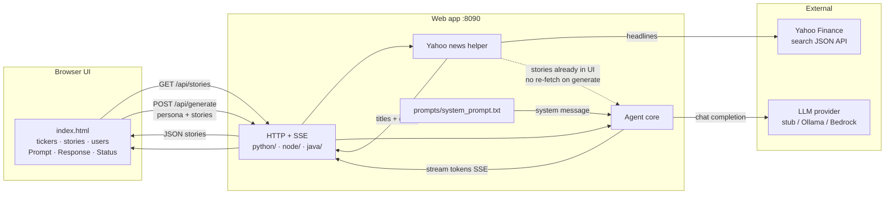

# 01-reference-agent

A **single-screen demo** that turns recent stock headlines into a short AI equity briefing.

You do **not** need a LaunchDarkly account to run this example. It is the **baseline** agent UI: news in → prompt + model → streamed report out. [12-agent-completion-config](../12-agent-completion-config/) adds LaunchDarkly **AgentControl** so model and prompts come from a completion config at runtime.

| Doc | Purpose |
|-----|---------|
| **This README** | What it is, architecture, and how to run |
| [python/README.md](python/README.md) | OS-specific setup (macOS, Linux, Windows, WSL) and Python details |
| [python-console/README.md](python-console/README.md) | Python curses console |
| [node-console/README.md](node-console/README.md) | Node.js terminal console |
| [java-console/README.md](java-console/README.md) | Java terminal console |
| [go/README.md](go/README.md) | Go terminal console |
| [rust/README.md](rust/README.md) | Rust terminal console |
| [cpp/README.md](cpp/README.md) | C++ terminal console |
| [node/README.md](node/README.md) | Node.js / npm web app setup (macOS, Linux, Windows, WSL) |
| [java/README.md](java/README.md) | Java / Maven web app setup (macOS, Linux, Windows, WSL) |
| [application.md](application.md) | Full behavior specification |
| [prompts/system_prompt.txt](prompts/system_prompt.txt) | The system prompt sent to the LLM |
| [stories/](stories/) | Shared Yahoo headline cache (`stories_cache.json`, gitignored) |
| [12-agent-completion-config](../12-agent-completion-config/) | Next: AgentControl completion config (model + prompts from LaunchDarkly) |

## What you will see

1. Enter two tickers (defaults: `NVDA`, `SPCX`) and click **Get Stories**.
2. Two panels show the latest Yahoo Finance headlines (titles are also saved locally for the next visit).
3. Choose a **user** with **Previous User** / **Next user** (Charlie, Nancy, or Toby). Switching users does **not** call the model.
4. Click **Generate AI Report** to stream a briefing into the **Response** panel.
5. Watch **Provider / model**, **Metrics**, and **Status** under the prompt/response row.

## Why this matters for LaunchDarkly learners

Today, the **system prompt is a file** and the **model provider is an environment variable**. That keeps the demo simple.

In later examples, LaunchDarkly can replace those fixed choices with **remotely configured** prompts and models—without rewriting the UI. Learning this baseline first makes those later changes easier to see.

```text
Today (this example)          Next (12-agent-completion-config)
─────────────────────         ─────────────────────────────────
system_prompt.txt      →      AgentControl system message
AGENT_LLM_MODE=ollama  →      AgentControl model on the variation
in-code user prompt    →      AgentControl user message
```

## Architecture — news to app to LLM



### Flow in plain language

| Step | What happens |
|------|----------------|
| **Get Stories** | Browser asks the server for headlines. The server calls Yahoo Finance, saves a local copy when successful, and fills the two story panels. |
| **Previous / Next User** | UI-only. Changes which demo user is selected. Does **not** fetch news and does **not** call the LLM. |
| **Generate AI Report** | Browser sends the **stories already on screen** plus the selected user id. The server loads [`prompts/system_prompt.txt`](prompts/system_prompt.txt) as the **system** message, builds a **user** message from the headlines, calls the LLM, and streams the answer. |

### System prompt (cited)

The model’s system instructions are the contents of [`prompts/system_prompt.txt`](prompts/system_prompt.txt). Current text:

```text
You are an expert institutional equity research analyst with expertise in:
- Fundamental equity analysis
- Industry analysis
- Valuation

Never fabricate financial values.

Your guidance must be direct, succinct, and based entirely on the information you are presented.

When you respond, include all of the following:

1. Your conclusion based on the news stories.
2. Whether one or more of the cited companies appear to be a good investment option, and why—cite the specific factors from the information provided.
3. Your confidence as a percentage from 0% to 100%, scored only from the information in the news stories.
4. If more than one company is presented, state which one you recommend as the better option and briefly why.
```

Edit that file to change analyst behavior. The server re-reads it on each generate (no restart required for prompt-only edits).

## Requirements by operating system

| Requirement | macOS | Linux | Windows |
|-------------|-------|-------|---------|
| **Python 3.12+** | [pyenv](https://github.com/pyenv/pyenv) or python.org installer | pyenv, distro packages, or deadsnakes | [python.org](https://www.python.org/downloads/) installer (check “Add python to PATH”), pyenv-win, or **WSL** (see [python/README.md](python/README.md#windows-with-wsl-windows-subsystem-for-linux)) |
| **Git** | Xcode CLT / Homebrew | Distro package (`git`) | [Git for Windows](https://git-scm.com/download/win) or Git inside WSL |
| **Virtual environment** | `python -m venv .venv` at **repo root** | Same | Same (`.\.venv\Scripts\activate`) or Linux steps inside WSL |
| **Root `requirements.txt`** | Required (`pip install -r requirements.txt`) | Same | Same |
| **Node.js 20 LTS** (npm web app) | [nvm](https://github.com/nvm-sh/nvm) + root [`.nvmrc`](../.nvmrc) | Same | nvm-windows, native Node installer, or **nvm inside WSL** |
| **Java 21+** (Maven web app) | Temurin / Homebrew OpenJDK | Distro JDK 21 | Temurin installer, or **OpenJDK inside WSL** |
| **Browser** | Any modern browser | Same | Same (including when the server runs in WSL) |
| **Network** | Needed for Yahoo headlines; optional for stub LLM | Same | Same |
| **Ollama** (optional) | [ollama.com](https://ollama.com) Mac app / install | Linux install script | Windows app / install |
| **AWS CLI + SSO** (optional Bedrock) | `brew install awscli` or pkg | Distro / pip | MSI from AWS |

**Python:** always use a virtual environment. Do not install project packages into the system Python.

**Windows + WSL:** install Ubuntu via `wsl --install`, then follow the Linux steps for Python, Node, or Java inside WSL. Details: [python/README.md — WSL](python/README.md#windows-with-wsl-windows-subsystem-for-linux), [node/README.md — WSL](node/README.md#windows-with-wsl), [java/README.md — WSL](java/README.md#windows-with-wsl).

Full copy-paste steps: **[python/README.md](python/README.md)** · **[node/README.md](node/README.md)** · **[java/README.md](java/README.md)**.

## Quick start — Python (stub)

From the **repository root**:

```bash
# 1. Create and activate a virtual environment
python -m venv .venv

# macOS / Linux / WSL:
source .venv/bin/activate

# Windows (PowerShell):
# .\.venv\Scripts\Activate.ps1

# 2. Install dependencies (repo-root requirements.txt)
pip install -r requirements.txt

# 3. Run the web app
cd 01-reference-agent/python
python 01-reference-agent.py
```

Open **http://127.0.0.1:8090/**

Default mode is **`stub`** (no Ollama/AWS required). Click **Get Stories**, then **Generate AI Report**.

## Quick start — Node.js / npm (stub)

From the **repository root**:

```bash
nvm install
nvm use
cd 01-reference-agent/node
npm start
```

Open **http://127.0.0.1:8090/** (same port as Python — run one language at a time).

## Quick start — Java / Maven (stub)

From this example’s Java folder:

```bash
cd 01-reference-agent/java
./mvnw clean package
java -jar target/01-reference-agent.jar
```

Open **http://127.0.0.1:8090/** (same port — run one language at a time).

## Quick start — Python console (stub)

From the **repository root** (venv active):

```bash
cd 01-reference-agent/python-console
python 01-reference-agent.py
```

Then use the on-screen hotkeys: `o` (stories) → `g` (generate) → `q` (quit). See [python-console/README.md](python-console/README.md).

## Quick start — Node / Java / Go / Rust / C++ console

```bash
# Node
cd 01-reference-agent/node-console && npm start

# Java
cd 01-reference-agent/java-console
./mvnw clean package
java -jar target/01-reference-agent-console.jar

# Go
cd 01-reference-agent/go
go build -o 01-reference-agent .
./01-reference-agent

# Rust
cd 01-reference-agent/rust
cargo build --release
./target/release/01-reference-agent

# C++
cd 01-reference-agent/cpp
make all
./01-reference-agent
```

Same hotkeys as the Python console (`t o s g m q n`). See language READMEs under each console folder.

If `AGENT_LLM_MODE` is unset and Ollama is reachable, consoles default to **ollama** (web apps still default to **stub**). `(m)ode` cycles `stub` → `ollama` → `bedrock`; Bedrock generate is implemented only in Python — other languages show a clear “not wired” error.

## Run with local Ollama (recommended for real text)

```bash
# Install Ollama, then:
ollama pull llama3.2:3b

# macOS / Linux:
cd 01-reference-agent/python
AGENT_LLM_MODE=ollama python 01-reference-agent.py

# Windows (PowerShell):
# cd 01-reference-agent\python
# $env:AGENT_LLM_MODE="ollama"
# python 01-reference-agent.py
```

Default Ollama model tag: **`llama3.2:3b`** (fast, small). Override with `OLLAMA_MODEL` if needed.

## Run with AWS Bedrock (optional)

```bash
aws sso login --profile Administrator
cd 01-reference-agent/python
export AGENT_LLM_MODE=bedrock    # Windows PowerShell: $env:AGENT_LLM_MODE="bedrock"
export AWS_REGION=us-east-1
python 01-reference-agent.py
```

Details: [application.md — AWS Bedrock](application.md#aws-bedrock).

## Language implementations

| Language | Directory | Type | Status |
|----------|-----------|------|--------|
| Python | [python/](python/) | Web | Available (`stub` / `ollama` / `bedrock`) |
| Node.js | [node/](node/) | Web | Available (`stub` / `ollama`) |
| Java | [java/](java/) | Web | Available (`stub` / `ollama`) |
| Python | [python-console/](python-console/) | Console | Available (`stub` / `ollama` / `bedrock`) |
| Node.js | [node-console/](node-console/) | Console | Available (`stub` / `ollama`) |
| Java | [java-console/](java-console/) | Console | Available (`stub` / `ollama`) |
| Go | [go/](go/) | Console | Available (`stub` / `ollama`) |
| Rust | [rust/](rust/) | Console | Available (`stub` / `ollama`) |
| C++ | [cpp/](cpp/) | Console | Available (`stub` / `ollama`) |

## Environment variables (summary)

| Variable | Default | Purpose |
|----------|---------|---------|
| `AGENT_LLM_MODE` | `stub` (web); consoles auto-`ollama` if daemon up | `stub` \| `ollama` \| `bedrock` \| `anthropic` |
| `AGENT_LLM_MODEL` | *(mode-specific)* | Optional model override |
| `OLLAMA_HOST` | `http://127.0.0.1:11434` | Local Ollama base URL |
| `OLLAMA_MODEL` | `llama3.2:3b` | Ollama model tag |
| `AWS_PROFILE` | `Administrator` | Bedrock SSO profile (Python) |
| `AWS_REGION` | `us-east-1` | Bedrock region (Python) |
| `AGENT_BEDROCK_MODEL_ID` | Nova Lite id | Bedrock model / inference profile (Python) |
| `PORT` | `8090` | HTTP listen port (Node / Java web) |

Full table: [application.md](application.md#configuration-environment-variables).
