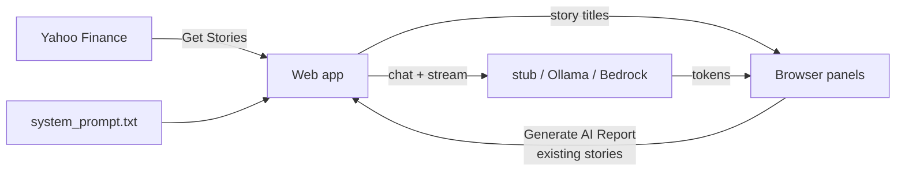

# Reference Agent — application specification

This document defines the behavior of **01-reference-agent**: a single-screen demo that builds an AI equity briefing from Yahoo Finance headlines.

Repository conventions: [project.md](../project.md).  
Human-oriented setup: [README.md](README.md), [python/README.md](python/README.md), [python-console/README.md](python-console/README.md), [node/README.md](node/README.md), and [java/README.md](java/README.md).

## LaunchDarkly note (for newcomers)

This reference uses **files and environment variables only**. It does **not** call LaunchDarkly.

That is intentional: you can learn the product flow (news → prompt → model → UI) before layering LaunchDarkly AI Config / AgentControl in later examples. Those later examples will swap *where* the system prompt and model choice come from—not the overall screen layout.

## Overview

A **single-screen** application (no login):

1. Enter two **tickers** and click **Get Stories** (Yahoo Finance headlines).
2. Optionally select a **user** (Previous User / Next user). This does not call the LLM.
3. Click **Generate AI Report** to stream a briefing from the headlines already on screen.
4. Inspect **Prompt** and **Response** (side by side), then **Provider / model**, **Metrics**, and **Status** below.

All language implementations must produce equivalent behavior. Differences are limited to platform-appropriate presentation (browser vs terminal).

### Console interaction

The [Python console](python-console/) uses a **curses UI** instead of web panels:

- Fixed chrome at the top:
  - Row 0: app banner (left), tickers with story counts (right) — e.g. `Tickers: NVDA (2 stories) SPCX (0 stories)`
  - Row 1: `AGENT_LLM_MODE` + `model` (left), user name (right)
  - Row 2: workflow hotkeys on the left (`(t)ickers st(o)ries (s)tatus (g)enerate report (m)ode (q)uit`), `(n)ext user` on the right
- Scrollable output pane below for headlines, prompt, streamed report, and metrics
- Same domain steps as the web app: set tickers → fetch headlines → select user → generate report from loaded stories
- Shared modules: [`python/agent_core.py`](python/agent_core.py), [`python/yahoo_news.py`](python/yahoo_news.py), [`prompts/system_prompt.txt`](prompts/system_prompt.txt)
- Story titles are persisted on disk in `python/stories_cache.json` (shared web/console); console restores the last pair on startup when present

## Architecture summary



See [README.md](README.md#architecture--news-to-app-to-llm) for the detailed diagram.

## Users (personas)

Fixed ordered list (wraps on Previous / Next):

| Order | Display name | Profile type |
|-------|--------------|--------------|
| 0 | Conservative Charlie | `conservative` |
| 1 | Neutral Nancy | `neutral` |
| 2 | Thoughtless Toby | `risk-taker` |

- Today, **all users share the same system prompt file**. Profile types are reserved for later LaunchDarkly variations.
- Previous / Next only change the selected user in the UI.

## System prompt

Path: [`prompts/system_prompt.txt`](prompts/system_prompt.txt)

Loaded on every generate as the LLM **system** message. The app re-reads the file each time so edits apply without restarting the server.

The prompt instructs the model to act as an institutional equity research analyst, never fabricate financial values, stay succinct, and return: conclusion, investment view with factors, confidence 0–100%, and a preferred company when two are present.

## User message (story-based)

Built from the two tickers’ headlines currently shown in the UI (typically two titles each). Defaults: `NVDA` and `SPCX`.

**Generate AI Report does not re-fetch Yahoo.** It uses the stories the browser sends in the POST body.

## Controls

| Control | Behavior |
|---------|----------|
| **Get Stories** | Fetch up to 2 headlines per ticker; update story panels; persist cache on success. Does **not** call the LLM. |
| **Previous User** | Previous persona (wrap). UI only. |
| **Next user** | Next persona (wrap). UI only. |
| **Generate AI Report** | Stream an LLM response from the on-screen stories + system prompt. |

While Get Stories or Generate is in flight, those controls (and ticker fields) disable; Previous/Next remain available for browsing users unless you choose to lock them in a given implementation.

## Primary presentation

| Region | Content |
|--------|---------|
| Tickers | Two text inputs + Get Stories |
| Story panels | Ticker name + titles (and publisher) for each ticker |
| User | Display name + profile; Previous User / Next user |
| Prompt | Story-derived user message sent to the model |
| Response | Streamed model output |
| Provider / model | e.g. `stub` / `default-no-llm`, or `ollama` / `llama3.2:3b` |
| Metrics | Industry-standard LLM metrics (see below) |
| Status | Idle, fetching, generating, success, or error messages |

Layout: Prompt and Response are **side by side**; Provider / Metrics / Status sit **below**.

## LLM modes

Provider is selected by environment (not LaunchDarkly in this reference).

| Mode (`AGENT_LLM_MODE`) | Behavior |
|---------------------------|----------|
| `stub` (default) | No network LLM call. Streams boilerplate for UI testing (`default-no-llm`). |
| `ollama` | Local Ollama server (default model `llama3.2:3b`). |
| `bedrock` | AWS Bedrock ConverseStream. |
| `anthropic` | Reserved for later. |

### Stub behavior

- Provider: `stub` / model: `default-no-llm`
- Response includes persona label and story titles so wiring is obvious
- Metrics may use character-length token estimates
- Streaming uses small chunks so the UI path matches real providers

## Streaming

- Responses stream into the Response panel (SSE).
- Metrics known only at the end update when the stream finishes.
- Time-to-first-token may update when the first chunk arrives.
- Status should show that work is in progress (e.g. “Generating AI report…”).

## Metrics (v1)

| Metric | Meaning |
|--------|---------|
| `latency_ms` | End-to-end generation time |
| `ttft_ms` | Time to first token |
| `prompt_tokens` | Input token count when available |
| `completion_tokens` | Output token count when available |
| `total_tokens` | Sum when available |
| `finish_reason` | e.g. `stop`, `length`, `error` |

Unavailable values render as `—`.

## Status / errors / safety

The status panel shows:

- Idle / fetching stories / generating / complete
- Provider errors (auth, network, timeout, rate limit)
- Safety or content-policy messages when present
- Clear, user-visible text (no silent failure)

## Configuration (environment variables)

### Mode and display

| Variable | Default | Purpose |
|----------|---------|---------|
| `AGENT_LLM_MODE` | `stub` | `stub` \| `ollama` \| `bedrock` \| `anthropic` |
| `AGENT_LLM_MODEL` | *(mode-specific)* | Override model id / name when applicable |

### Ollama

| Variable | Default | Purpose |
|----------|---------|---------|
| `OLLAMA_HOST` | `http://127.0.0.1:11434` | Ollama base URL |
| `OLLAMA_MODEL` | `llama3.2:3b` | Model tag (small/fast default) |

### AWS Bedrock

**Recommended:** AWS IAM Identity Center (SSO) with profile `Administrator` in `~/.aws/config`.

```bash
aws sso login --profile Administrator
export AWS_PROFILE=Administrator   # optional; this is the app default
export AWS_REGION=us-east-1
export AGENT_LLM_MODE=bedrock
```

The Python Bedrock path uses the named SSO profile even if ambient `AWS_ACCESS_KEY_ID` / secret / session token are set in the shell.

| Variable | Purpose |
|----------|---------|
| `AWS_PROFILE` | Named profile (default `Administrator`) |
| `AWS_REGION` or `AWS_DEFAULT_REGION` | Region (default `us-east-1` if unset) |
| `AGENT_BEDROCK_MODEL_ID` | Bedrock model id (default `us.amazon.nova-lite-v1:0`) |

Recommended report models: Nova Lite, Claude Haiku 4.5, Qwen3 32B (see README). Prefer general text models over coding-specialized Qwen Coder variants.

### Anthropic

| Variable | Purpose |
|----------|---------|
| `ANTHROPIC_API_KEY` | API key |
| `ANTHROPIC_MODEL` | Model id (optional override) |

## Out of scope (this reference)

- Login / multi-screen flows
- LaunchDarkly AgentControl / AI Config (deferred to later examples)
- C++ implementation (optional; may be omitted)

## Language matrix

Same conventions as [00-reference-code](../00-reference-code/):

| Language | Planned |
|----------|---------|
| Python web | Available (`stub` / `ollama` / `bedrock`) |
| Node.js web | Available (`stub` / `ollama`) |
| Java web | Available (`stub` / `ollama`) |
| Python console | Available (`stub` / `ollama` / `bedrock`) |
| Node.js console | Later |
| Java console | Later |
| Go console | Later |
| Rust console | Later (HTTP/REST to providers) |
| C++ | Likely omitted |

## Acceptance criteria

1. App loads to a single screen with user **Conservative Charlie** (no mandatory auto-generate).
2. Previous / Next cycle Charlie → Nancy → Toby → Charlie without calling the LLM.
3. Default `AGENT_LLM_MODE=stub` works with **no API keys**.
4. Get Stories fills two headline panels (live or cache fallback).
5. Generate AI Report streams into Response using `prompts/system_prompt.txt` + on-screen stories.
6. Prompt and Response are separate side-by-side panels; provider, metrics, and status are below.
7. Provider and model are visible.
8. Metrics panel shows the v1 fields (or `—`).
9. Errors and in-progress work appear in the status panel.

## Related

- [00-reference-code/application.md](../00-reference-code/application.md) — grid navigator reference (no LLM)
- Later: LaunchDarkly AgentControl / AI Config variations of this agent UI
