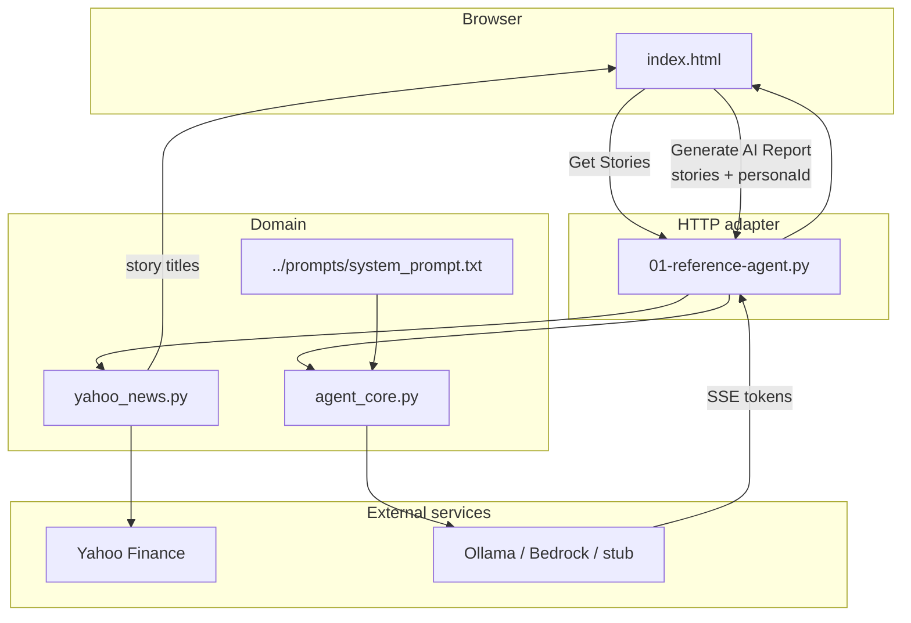

# Python web — setup and run

This is the first implementation of [01-reference-agent](../README.md). It is a small local web server plus a browser UI.

Setup covers **macOS**, **Linux**, **Windows**, and **Windows with WSL**. The Node twin lives in [../node/](../node/).

If you are new to LaunchDarkly: **you do not need LaunchDarkly to run this.** Provider and prompt are controlled by files and environment variables. LaunchDarkly appears in later examples.

## What you need (all platforms)

| Item | Required? | Notes |
|------|-----------|--------|
| Python **3.12+** | Yes | Prefer 3.12 to match the repo |
| **Virtual environment** at repository root (`.venv`) | Yes | Never install into system Python |
| Repo-root [`requirements.txt`](../../requirements.txt) | Yes | Shared by all Python examples |
| Modern browser | Yes | UI is at http://127.0.0.1:8090/ |
| Network access | For headlines | Yahoo Finance; also for `pip` / `ollama pull` |
| [Ollama](https://ollama.com/) | Optional | Real local LLM (`AGENT_LLM_MODE=ollama`) |
| AWS SSO + Bedrock access | Optional | Cloud LLM (`AGENT_LLM_MODE=bedrock`) |

There is **no** per-example `requirements.txt`. Always install from the **repository root**.

---

## Setup by operating system

### macOS

1. Install Python 3.12+ (pick one):
   - [pyenv](https://github.com/pyenv/pyenv): `pyenv install 3.12` then use that version in this repo
   - Or the installer from [python.org](https://www.python.org/downloads/)
2. Install Git if needed (`xcode-select --install` or Homebrew).
3. Optional — Ollama: download from [ollama.com](https://ollama.com), then `ollama pull llama3.2:3b`.
4. Optional — AWS CLI: `brew install awscli` (for Bedrock SSO).

From the **repository root** (`lunch-marcoly/`):

```bash
python -m venv .venv
source .venv/bin/activate
pip install -r requirements.txt
```

### Linux

1. Install Python 3.12+ (examples):
   - Ubuntu/Debian: `sudo apt update && sudo apt install python3.12 python3.12-venv python3-pip git`
   - Or [pyenv](https://github.com/pyenv/pyenv)
   - Ensure `python3 --version` reports 3.12+
2. Optional — Ollama: follow the Linux install at [ollama.com](https://ollama.com), then `ollama pull llama3.2:3b`.
3. Optional — AWS CLI via your package manager or the official installer.

From the **repository root**:

```bash
python3 -m venv .venv
source .venv/bin/activate
pip install -r requirements.txt
```

If `python` is not on your PATH, use `python3` consistently after activating `.venv` (the venv’s `python` should point at 3.12+).

### Windows

1. Install [Python 3.12+](https://www.python.org/downloads/windows/).
   - Enable **“Add python.exe to PATH”**.
   - Enable **pip**.
2. Install [Git for Windows](https://git-scm.com/download/win).
3. Optional — [Ollama for Windows](https://ollama.com), then in PowerShell: `ollama pull llama3.2:3b`.
4. Optional — [AWS CLI MSI](https://docs.aws.amazon.com/cli/latest/userguide/getting-started-install.html) for Bedrock SSO.

From the **repository root** in **PowerShell**:

```powershell
python -m venv .venv
.\.venv\Scripts\Activate.ps1
pip install -r requirements.txt
```

If script activation is blocked:

```powershell
Set-ExecutionPolicy -Scope CurrentUser RemoteSigned
```

Command Prompt alternative:

```bat
python -m venv .venv
.venv\Scripts\activate.bat
pip install -r requirements.txt
```

### Windows with WSL (Windows Subsystem for Linux)

WSL lets you use the **Linux** setup inside Windows. This is a good option if you already use Ubuntu on WSL or prefer bash/`pyenv`/`nvm` workflows.

1. Install WSL + a Linux distro (Ubuntu recommended), from **PowerShell (Admin)**:

   ```powershell
   wsl --install
   ```

   Restart if prompted, then open **Ubuntu** from the Start menu.

2. Inside the WSL terminal, install Python tools (Ubuntu example):

   ```bash
   sudo apt update
   sudo apt install -y python3.12 python3.12-venv python3-pip git
   ```

3. Clone or open this repository **from the Linux filesystem** when possible (for example `~/code/lunch-marcoly`).  
   Using `/mnt/c/...` works but is slower for `venv` and `pip`.

4. Follow the **Linux** virtualenv steps from the repository root:

   ```bash
   python3 -m venv .venv
   source .venv/bin/activate
   pip install -r requirements.txt
   cd 01-reference-agent/python
   python 01-reference-agent.py
   ```

5. In Windows, open a browser to **http://127.0.0.1:8090/** (WSL port forwarding usually exposes the app to Windows automatically on current WSL versions).

6. Optional — Ollama:
   - Run Ollama on **Windows** and point WSL at it if needed (`OLLAMA_HOST`), or
   - Install Ollama inside WSL/Linux and use `http://127.0.0.1:11434` as usual.

For Node.js under WSL, install [nvm](https://github.com/nvm-sh/nvm) inside WSL and follow [node/README.md](../node/README.md) the same way as on Linux.

---

## Run the application

Always activate `.venv` first (from the repository root).

### Stub mode (no LLM keys — default)

**macOS / Linux**

```bash
source .venv/bin/activate
cd 01-reference-agent/python
python 01-reference-agent.py
```

**Windows (PowerShell)**

```powershell
.\.venv\Scripts\Activate.ps1
cd 01-reference-agent\python
python 01-reference-agent.py
```

Then open: **http://127.0.0.1:8090/**

Press `Ctrl+C` in the terminal to stop the server.

### Ollama mode (local model)

1. Confirm Ollama is running and the model is pulled: `ollama pull llama3.2:3b`
2. Start the app with mode `ollama`:

**macOS / Linux**

```bash
source .venv/bin/activate
cd 01-reference-agent/python
AGENT_LLM_MODE=ollama python 01-reference-agent.py
```

**Windows (PowerShell)**

```powershell
.\.venv\Scripts\Activate.ps1
cd 01-reference-agent\python
$env:AGENT_LLM_MODE="ollama"
python 01-reference-agent.py
```

Optional overrides: `$env:OLLAMA_MODEL="llama3.2:3b"` / `OLLAMA_HOST=http://127.0.0.1:11434`.

### Bedrock mode (AWS)

```bash
aws sso login --profile Administrator
# then set AGENT_LLM_MODE=bedrock and AWS_REGION=us-east-1 (see parent README)
```

---

## What to do in the UI

1. Confirm tickers (or change them).
2. Click **Get Stories** — fills the two headline panels (may use cache if Yahoo rate-limits).
3. Optionally click **Previous User** / **Next user** — changes the demo user label only.
4. Click **Generate AI Report** — streams the LLM answer using:
   - **System:** [`../prompts/system_prompt.txt`](../prompts/system_prompt.txt)
   - **User:** the headlines currently shown (not re-fetched)
5. Read **Prompt** (left) and **Response** (right); check **Status** and **Metrics** below.

---

## Architecture — how the code is organized



| File | Role |
|------|------|
| [`index.html`](index.html) | UI: tickers, stories, users, Prompt / Response, metrics, status |
| [`01-reference-agent.py`](01-reference-agent.py) | HTTP only: static page, `/api/bootstrap`, `/api/stories`, `POST /api/generate` (SSE) |
| [`yahoo_news.py`](yahoo_news.py) | Yahoo Finance fetch + `stories_cache.json` fallback |
| [`agent_core.py`](agent_core.py) | Personas, prompt assembly, stub/Ollama/Bedrock streaming, metrics |
| [`../prompts/system_prompt.txt`](../prompts/system_prompt.txt) | System prompt for the equity analyst persona |

### Request map

| Method | Path | Purpose |
|--------|------|---------|
| `GET` | `/` | UI |
| `GET` | `/api/bootstrap` | Personas, defaults, cached stories, provider/model labels |
| `GET` | `/api/stories?ticker1=&ticker2=` | Fetch (or cache-fallback) headlines |
| `POST` | `/api/generate` | Body: `{ personaId, stories }` → SSE token stream (**no** Yahoo re-fetch) |

---

## Environment variables

| Variable | Default | Notes |
|----------|---------|-------|
| `AGENT_LLM_MODE` | `stub` | `stub`, `ollama`, or `bedrock` |
| `OLLAMA_HOST` | `http://127.0.0.1:11434` | Local Ollama |
| `OLLAMA_MODEL` | `llama3.2:3b` | Model tag |
| `AWS_PROFILE` | `Administrator` | Bedrock SSO profile |
| `AWS_REGION` | `us-east-1` | Bedrock region |
| `AGENT_BEDROCK_MODEL_ID` | `us.amazon.nova-lite-v1:0` | Bedrock model id |

More detail: [application.md](../application.md#configuration-environment-variables).

---

## Troubleshooting

| Symptom | What to try |
|---------|-------------|
| `Address already in use` on 8090 | Stop the other process using that port, then start again |
| Yahoo HTTP 429 / empty stories | Wait and retry **Get Stories**; last good titles may load from cache |
| Ollama errors | Confirm `ollama serve` / app is running and `ollama list` shows `llama3.2:3b` |
| Bedrock AccessDenied | Re-run `aws sso login --profile Administrator`; confirm model access in the Bedrock console |
| Wrong Python | `which python` / `Get-Command python` should point inside `.venv` |

---

## Parent docs

- [01-reference-agent README](../README.md) — overview + architecture diagram
- [application.md](../application.md) — behavior specification
- [Root README — Python and pyenv](../../README.md#python-and-pyenv)
