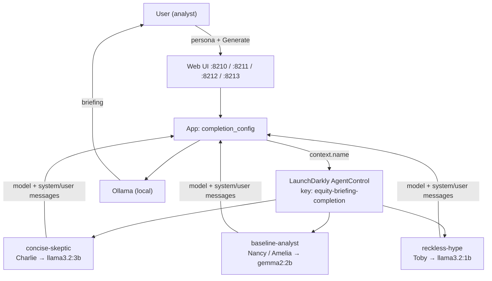

# 21-agent-completion-config

LaunchDarkly **AgentControl** for the equity briefing agent: serve **model**, **system prompt**, and **user prompt** from an AgentControl **completion config** at runtime—without redeploying.

Series landing page (Ollama, AWS SSO, shared env): [../README.md](../README.md).

## What this demonstrates

[01-reference-agent](../../01-reference-agent/) loads the system prompt from a file and picks the model from `AGENT_LLM_MODE` / env. This example keeps the **same UI and news → generate flow**, but replaces those hardcoded sources with LaunchDarkly.

| At generate time | 01-reference-agent | This example (`21`) |
|------------------|--------------------|---------------------|
| Model | Env / mode override | AgentControl config variation |
| System prompt | `prompts/system_prompt.txt` | AgentControl **system** message |
| User prompt | Built in code from Yahoo headlines | AgentControl **user** message (with runtime variables / app-supplied content as specified) |

Keywords: **AgentControl** · **completion config** · **completion mode** · **config variations** · **model configuration** · **system/user messages** · **AI SDK**

## Architecture

The user picks a persona and generates a briefing. LaunchDarkly **targets** a variation (prompts + model) from the context `name`; the app streams the model response—no tools yet (those arrive in [23](../23-agent-tools/)).



### LaunchDarkly keys (convenience)

| Kind | Key |
|------|-----|
| AI config | `equity-briefing-completion` |
| Variation | `baseline-analyst` (fallthrough / Nancy / Amelia) |
| Variation | `concise-skeptic` (Conservative Charlie) |
| Variation | `reckless-hype` (Thoughtless Toby) |
| Model config | `Custom.gemma2-2b` · `Custom.llama3.2-3b` · `Custom.llama3.2-1b` |

Status helper: `./rest/get-targeting-status.sh`.

## LaunchDarkly documentation

| Topic | Docs |
|-------|------|
| AgentControl overview | [AgentControl](https://launchdarkly.com/docs/home/agentcontrol) |
| Quickstart (completion mode) | [Quickstart for AgentControl](https://launchdarkly.com/docs/home/agentcontrol/quickstart) |
| Config outside of code | [Managing AI model configuration outside of code](https://launchdarkly.com/docs/guides/agentcontrol/config-outside-code-nodejs) |
| Best practices | [Building with AgentControl configs](https://launchdarkly.com/docs/guides/agentcontrol/best-practices) |

Full behavior, config key, variations, and acceptance criteria: [application.md](application.md).

## Prerequisites

Shared setup: [20-agent-config README](../README.md) (LaunchDarkly SDK key, **required Ollama models**, optional **AWS SSO** for Bedrock).

Also required for this example:

- Access to create **AgentControl** configs
- The **three Ollama tags** below (generate fails for a persona if its model is missing)
- Optional later: cloud reachability if you retarget a variation to Bedrock / another provider

```bash
export LD_PROJECT_KEY="default"
export LD_ENVIRONMENT_KEY="test"
export LD_SDK_KEY="sdk-..."
```

## Required Ollama models

This example’s success story is **persona → different completion variation → different local model**. LaunchDarkly can swap prompts and model ids without redeploying, but Ollama must already have each tag on disk. Pulling all three is a **requirement**, not an optional optimization.

**Why local models first**

- Anyone can test AgentControl (targeting, variations, UI chrome) **without a cloud LLM account**.
- Classroom and laptop demos stay reproducible: same three tags, same ports, same REST provisioning.
- You can still use **cloud** models later for enhanced quality—retarget a variation to Bedrock (or another provider) once SSO/credentials work. Local Ollama remains the default path that makes the demo succeed for everyone.

| Tier | Ollama tag | Persona | Variation | Role in the demo |
|------|------------|---------|-----------|------------------|
| Best | `llama3.2:3b` | Conservative Charlie | `concise-skeptic` | Strongest local model of this lot |
| Default | `gemma2:2b` | Neutral Nancy, Anonymous Amelia | `baseline-analyst` | Middle tier; fallthrough |
| Simple | `llama3.2:1b` | Thoughtless Toby | `reckless-hype` | Smallest / most cost-effective local model |

Install and start [Ollama](https://ollama.com), then pull **all three**:

```bash
ollama pull llama3.2:3b    # required — Charlie (best)
ollama pull gemma2:2b      # required — Nancy / Amelia (default)
ollama pull llama3.2:1b    # required — Toby (simple)
```

Verify before generate:

```bash
ollama list
# expect llama3.2:3b, gemma2:2b, and llama3.2:1b
curl -s http://127.0.0.1:11434/api/tags | head
```

If `ollama list` is missing a tag, switching to that persona and pressing **Generate** will error until you pull it. Series overview: [../README.md](../README.md#3-llm-providers-start-here).

## Relationship to 01-reference-agent

```text
01-reference-agent          21-agent-completion-config
─────────────────────       ──────────────────────────
system_prompt.txt    →      AgentControl system message
AGENT_LLM_MODE       →      AgentControl model (+ provider)
in-code user prompt  →      AgentControl user message
Yahoo + UI chrome    →      unchanged product shape
```

Reuse the shared mental model from [01-reference-agent/README.md](../../01-reference-agent/README.md); this folder is where LaunchDarkly enters the generate path.

## Provisioning

| Approach | Directory | Status |
|----------|-----------|--------|
| **REST / scripts** (preferred) | [rest/](rest/) | Ready — `./create-config.sh` |
| UI checklist | [PROVISIONING.md](PROVISIONING.md) | Ready — dashboard fallback |
| Spec / acceptance | [application.md](application.md) | Ready |
| Terraform | [terraform/](terraform/) | Planned |

```bash
export LD_API_ACCESS_TOKEN="api-..."
export LD_PROJECT_KEY="lunch-marcoly"
export LD_ENVIRONMENT_KEY="test"

cd rest && chmod +x *.sh && ./create-config.sh
```

## Language implementations

| Language | Directory | Type | Status |
|----------|-----------|------|--------|
| Python | [`python/`](python/) | Web | Ready — http://127.0.0.1:8210/ |
| Node.js | [`node/`](node/) | Web | Ready — http://127.0.0.1:8211/ |
| Java | [`java/`](java/) | Web | Ready — http://127.0.0.1:8212/ |
| .NET | [`dotnet/`](dotnet/) | Web | Ready — http://127.0.0.1:8213/ |
| Python | [`python-console/`](python-console/) | Console | Ready — curses; `(l)d` for LD details |
| Go / Rust / C++ | — | — | Later |

Start with **[rest/](rest/)**, then run any web language against that config.

| Port | Language |
|------|----------|
| 8210 | Python |
| 8211 | Node.js |
| 8212 | Java |
| 8213 | .NET |

Java note: there is no official LaunchDarkly **Java AI SDK** yet. The Java example evaluates the AgentControl config with the **server SDK** JSON variation API (`jsonValueVariationDetail`) and substitutes `{{ stories }}` locally — same config key and targeting as Python/Node/.NET.

.NET note: uses [`LaunchDarkly.ServerSdk.Ai`](https://launchdarkly.com/docs/sdk/ai/dotnet) (`CompletionConfig`) on **net10.0**. The AI SDK is pre-1.0; Python/Node often get features first.


## Further reading

- [rest/README.md](rest/README.md) — REST provisioning (preferred; no MCP); `get-targeting-status.sh` for demo health
- [python/README.md](python/README.md) — Python web
- [python-console/README.md](python-console/README.md) — Python console (curses)
- [node/README.md](node/README.md) — Node.js web
- [java/README.md](java/README.md) — Java web (server SDK JSON evaluation)
- [dotnet/README.md](dotnet/README.md) — .NET web (AI SDK `CompletionConfig`)
- [PROVISIONING.md](PROVISIONING.md) — UI checklist + copy-paste messages
- [application.md](application.md) — AgentControl completion config specification
- [../README.md](../README.md) — series setup (Ollama, AWS, LaunchDarkly)
- [01-reference-agent/application.md](../../01-reference-agent/application.md) — baseline agent UI (no LaunchDarkly)
- [project.md](../../project.md) — repository conventions
