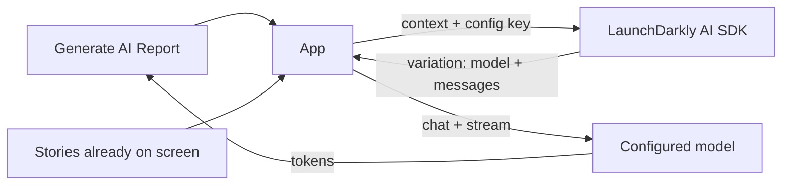

# Agent completion config — application specification

This document defines **21-agent-completion-config**: the equity briefing agent from [01-reference-agent](../../01-reference-agent/application.md), with LaunchDarkly **AgentControl** supplying the **model**, **system prompt**, and **user prompt** at generate time.

Repository conventions: [project.md](../../project.md).  
Series setup: [20-agent-config README](../README.md).  
Human-oriented overview: [README.md](README.md).

## Goal

Show the smallest useful AgentControl story:

1. Same product UI and Yahoo → generate flow as `01-reference-agent`.
2. At **Generate AI Report**, the app fetches an AgentControl **completion config** variation.
3. That variation supplies **model**, **system** message, and **user** message used for the LLM call.
4. Changing the variation in LaunchDarkly changes behavior **without redeploying** the example.

This example uses **completion mode** (single-step messages + model), not multi-step **agent mode**.

## LaunchDarkly capabilities (keywords + docs)

| Capability | Keywords | Documentation |
|------------|----------|---------------|
| Product | AgentControl | [AgentControl](https://launchdarkly.com/docs/home/agentcontrol) |
| Config shape | completion config, completion mode, messages, roles | [Quickstart for AgentControl](https://launchdarkly.com/docs/home/agentcontrol/quickstart) |
| Runtime fetch | AI SDK, completion config evaluation | [AI SDKs](https://launchdarkly.com/docs/sdk/ai) |
| Iterate without deploy | config variations, targeting | [Managing AI model configuration outside of code](https://launchdarkly.com/docs/guides/agentcontrol/config-outside-code-nodejs) |
| Patterns | multi-provider, fallbacks | [AgentControl best practices](https://launchdarkly.com/docs/guides/agentcontrol/best-practices) |

## What stays the same as 01

- Single-screen UI (web panels or console chrome)
- Tickers → Get Stories (Yahoo) → optional user cycle → Generate
- Streamed response, provider/model display, metrics, status
- Shared stories cache concept under this example’s `stories/` (when implementations land)
- Demo personas: Conservative Charlie, Neutral Nancy, Thoughtless Toby, Anonymous Amelia (anonymous context → fallthrough)

## What changes vs 01

| Concern | 01-reference-agent | 21-agent-completion-config |
|---------|--------------------|----------------------------|
| System instructions | File `prompts/system_prompt.txt` | AgentControl **system** message on the served variation |
| User content | Built only in application code | AgentControl **user** message (may include template variables; app may still inject headline text per variation design) |
| Model / provider | `AGENT_LLM_MODE` + env model ids | Model (and provider metadata) from the AgentControl variation |
| LaunchDarkly | None | Required for the happy path; document a local fallback for offline demos |

## Recommended AgentControl config

**REST scripts (preferred):** [rest/README.md](rest/README.md).  
**UI checklist (copy-paste messages, targeting, smoke-check):** [PROVISIONING.md](PROVISIONING.md).

Naming follows LaunchDarkly resource style: clear name, kebab-case **key**.

| Attribute | Value |
|-----------|-------|
| **Name** | `Equity briefing completion` |
| **Key** | `equity-briefing-completion` |
| **Mode** | Completion |
| **Purpose** | Serve model + system/user messages for the equity briefing generate step |
| **SDK call** | AI SDK `completion_config` (not agent mode) |

### Variations (summary)

| Variation | Persona | Role | Ollama model |
|-----------|---------|------|--------------|
| `baseline-analyst` | Nancy / Amelia (fallthrough) | Default analyst voice | `gemma2:2b` (default tier) |
| `concise-skeptic` | Conservative Charlie | Shorter skeptical voice | `llama3.2:3b` (best tier) |
| `reckless-hype` | Thoughtless Toby | No caution; fabricates freely | `llama3.2:1b` (simple tier) |

Both message sets use a **user** message that includes the variable `{{ stories }}`. The app passes the formatted headline block as `stories` when calling `completion_config`. Full message text: [PROVISIONING.md](PROVISIONING.md) · [rest/messages/](rest/messages/). Model keys: [rest/README.md](rest/README.md).

Targeting a different variation (or editing the default) should visibly change the streamed report **and** the served model id without rebuilding the app.

## Application generate path

### Generate step (normative)

1. Build or refresh the LaunchDarkly evaluation **context** (at minimum: user key from the selected persona; optional custom attributes later).
2. Request the AgentControl completion config by key `equity-briefing-completion` (or the key documented in the language README if overridden by env).
3. Read from the result:
   - **Model** name (and provider as exposed by the SDK)
   - **Messages** with roles `system` and `user` (and any other roles the variation defines)
4. Ensure headline content is available to the model by passing `{"stories": <formatted headlines>}` into `completion_config` so `{{ stories }}` in the user message is substituted ([customizing configs](https://launchdarkly.com/docs/sdk/features/agentcontrol-config)).
5. Call the LLM with that model and message list; stream tokens to the UI.
6. Surface the **served** provider/model in the status chrome (not only the old `AGENT_LLM_MODE` env).
7. On LD or provider failure: show a clear status error; optional **fallback** config (stub or local file) may be documented per language for classroom use.

### Context (minimum)

| Attribute | Source |
|-----------|--------|
| Kind | `user` |
| Key | Persona id (e.g. `conservative-charlie`, `anonymous-amelia`) |
| Name | Persona display name |
| Anonymous | `true` only for **Anonymous Amelia** ([anonymous contexts](https://launchdarkly.com/docs/sdk/features/anonymous)) |

Named personas can match name-based targeting. Anonymous Amelia is not targeted by name rules and receives the **fallthrough** variation (`baseline-analyst`).

## Environment variables (summary)

| Variable | Purpose |
|----------|---------|
| `LD_SDK_KEY` | Server-side SDK key for the target environment |
| `LD_AGENT_CONFIG_KEY` | Optional override; default `equity-briefing-completion` |
| Provider keys / `OLLAMA_*` | As required by the model named in the served variation |

Exact AI SDK package names and init snippets live in each language README when implementations land.

## Out of scope (this example)

- Multi-step **agent mode** / tool-calling workflows ([Agents](https://launchdarkly.com/docs/home/agentcontrol/agents))
- Experimentation / guarded rollouts on configs (later examples)
- Replacing Yahoo fetch with LD
- Full parity of every 01 language on day one (Python first)

## Acceptance criteria

1. UI still matches 01’s single-screen generate flow (web or console).
2. Generate uses LaunchDarkly AgentControl for **model**, **system** message, and **user** message (completion config).
3. Editing the config variation in LaunchDarkly changes generate behavior without redeploying the example binary/app.
4. Provider/model shown in the UI reflects the **served** variation.
5. Missing `LD_SDK_KEY` or a **disabled** AgentControl config falls back to the in-code **baseline-analyst** prompts (same text as `rest/messages/baseline-*.txt`), clearly labeled in the UI (e.g. `code baseline`).
6. README and [PROVISIONING.md](PROVISIONING.md) link to AgentControl docs with the keywords above.
7. Provisioned config matches [PROVISIONING.md](PROVISIONING.md) (key, completion mode, `{{ stories }}`, default → `baseline-analyst`).

## Related

- [20-agent-config README](../README.md) — shared Ollama / AWS / LaunchDarkly setup
- [01-reference-agent/application.md](../../01-reference-agent/application.md) — baseline without LaunchDarkly
- [11-flag-variations](../../11-flag-variations/) — classic feature-flag variation types (grid navigator)
- [AgentControl quickstart](https://launchdarkly.com/docs/home/agentcontrol/quickstart)
