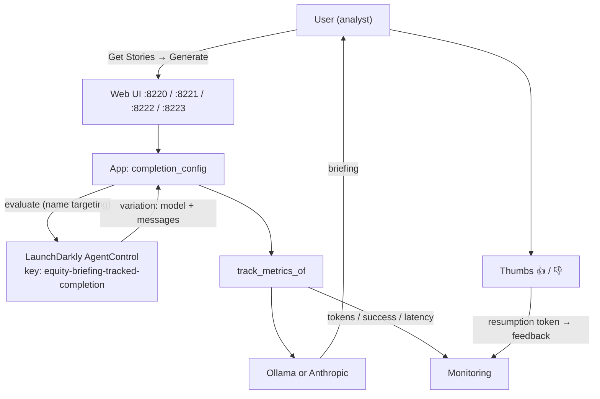

# 22-config-outside-code

AgentControl **tracked completion**: model + prompts live in LaunchDarkly, and every generate is wrapped in **`track_metrics_of`** so tokens / success / latency show up in the config **Monitoring** tab. Thumbs up/down send **feedback** via a resumption token.

Templated from [01-reference-agent](../../01-reference-agent/) (same news → generate UI). Sibling of [21-agent-completion-config](../21-agent-completion-config/); 21 teaches completion config + personas; **22 headlines metrics + feedback**.

Inspired by: [Managing AI model configuration outside of code (Node.js)](https://launchdarkly.com/docs/guides/agentcontrol/config-outside-code-nodejs) — same idea here with Ollama + Anthropic (Python / Node / Java).

## Architecture

The user still generates a briefing from headlines; LaunchDarkly owns the **prompts and model**, and every generate is **tracked** so Monitoring (and thumbs) reflect what actually ran.



### LaunchDarkly keys (convenience)

| Kind | Key |
|------|-----|
| AI config | `equity-briefing-tracked-completion` |
| Variation (fallthrough / Amelia) | `tracked-ollama` |
| Variation (Best Betty) | `tracked-anthropic` |

Override with `LD_AGENT_CONFIG_KEY` if needed. Status helper: `./rest/get-feedback-status.sh`.

## Languages

| Language | Port | Status |
|----------|------|--------|
| Python web | **8220** | v1 — `track_metrics_of` + official feedback; **Trace** includes thumbs |
| Node web | **8221** | v1 — same AI SDK path as Python; **Trace** includes thumbs |
| Java web | **8222** | v1 — server SDK eval + Anthropic/Ollama; feedback via `track`; **Trace** includes thumbs |
| .NET web | **8223** | v1 — AI SDK `CompletionConfig` + `TrackMetricsOf` + `TrackFeedback`; **Trace** includes thumbs |
| Go console | — | v1 — raw-terminal TUI; AI SDK `CompletionConfig` + `ldai.TrackMetricsOf` + `TrackFeedback`; `+`/`-` hotkeys |

## Config

| | |
|--|--|
| Key | `equity-briefing-tracked-completion` |
| Mode | completion |
| Fallthrough | `tracked-ollama` → `llama3.2:1b` |
| Best Betty | `tracked-anthropic` → `claude-sonnet-5` |

## Quick start

```bash
# Series setup (SDK key, Ollama) — see ../README.md
export LD_SDK_KEY=sdk-...
export LD_PROJECT_KEY=lunch-marcoly
export LD_ENVIRONMENT_KEY=test   # or production
export LD_API_ACCESS_TOKEN=...

# Provision once
cd rest
./create-config.sh
./update-name-targeting.sh

# Ollama (Anonymous Amelia / fallthrough)
ollama pull llama3.2:1b

# Anthropic (Best Betty) — optional but required for that persona
export ANTHROPIC_API_KEY=sk-ant-...

# Python (8220)
cd ../python
source ../../../.venv/bin/activate
python 22-config-outside-code.py

# Node (8221)
cd ../node && npm install && npm start

# Java (8222)
cd ../java && ./mvnw -q -DskipTests package && java -jar target/22-config-outside-code.jar

# .NET (8223)
export PATH="/usr/local/share/dotnet:$PATH"
cd ../dotnet && dotnet restore && dotnet build && dotnet run

# Go console (raw-terminal TUI; no port)
cd ../go && go mod tidy && go build -o 22-config-outside-code . && ./22-config-outside-code
```

Java note: no official **Java AI SDK** yet — server SDK JSON evaluation + best-effort `track` for thumbs.

.NET note: [`LaunchDarkly.ServerSdk.Ai`](https://launchdarkly.com/docs/sdk/ai/dotnet) (`CompletionConfig` · `TrackMetricsOf` · `TrackFeedback`) on **net10.0**. AI SDK is **pre-1.0**.

Go note: separate [`go-server-sdk-ai`](https://launchdarkly.com/docs/sdk/ai/go) module — **not** bundled `go-server-sdk/v7/ldai`. `ldai.TrackMetricsOf` is a **package function**, not a tracker method. See [go/README.md](go/README.md#go-ai-sdk-note-api-quirks-vs-python--node--net).

## What to try

1. **Anonymous Amelia** → local Ollama; after generate, check Monitoring + try 👍/👎 (or `+`/`-` in the Go console).
2. **Best Betty** → Anthropic Claude; same metrics + feedback path (Python/Node/.NET/Go; Java thumbs use best-effort `track`).
3. Edit prompts on the variation in the LD UI — no code change, no redeploy.

## Docs

- [application.md](application.md) — normative behavior
- [python/README.md](python/README.md) · [node/README.md](node/README.md) · [java/README.md](java/README.md) · [dotnet/README.md](dotnet/README.md) · [go/README.md](go/README.md)
- Series: [../README.md](../README.md)
