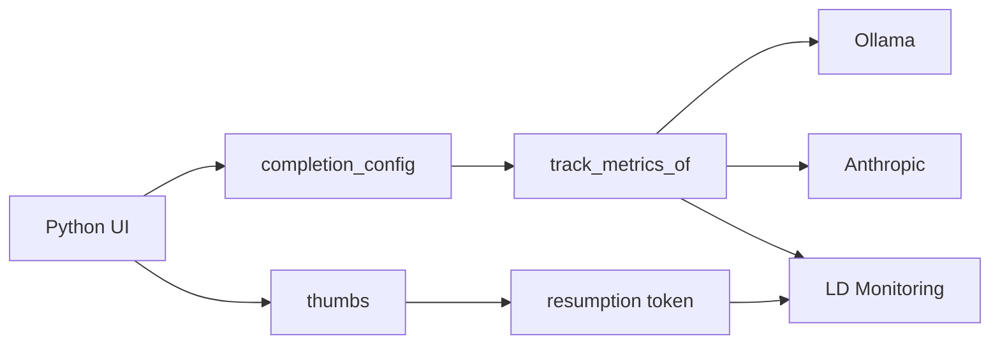

# 22-config-outside-code — application

## Goal

Same equity-briefing **news → generate** product as [01-reference-agent](../../01-reference-agent/), but:

1. **Model + system/user prompts** come from LaunchDarkly AgentControl (config outside code).
2. Every successful path records AI metrics with **`track_metrics_of`** (Monitoring).
3. **Thumbs** record `FeedbackKind` against the generation’s **resumption token**.

Keywords: AgentControl · completion config · AI metrics · feedback · message variables  
Docs: https://launchdarkly.com/docs/home/agentcontrol · https://launchdarkly.com/docs/sdk/ai/python  
Guide (pattern source): https://launchdarkly.com/docs/guides/agentcontrol/config-outside-code-nodejs

## Same vs 01 / 21

| | 01 | 21 | **22** |
|--|----|----|--------|
| UI shell | news → generate | same | same |
| Model / prompts | files + `AGENT_LLM_MODE` | AgentControl | AgentControl |
| Headline | reference agent | completion config + personas | **metrics + feedback** |
| Default LLM | stub / ollama / bedrock | Ollama tiers | **Ollama 1b** |
| Enhanced LLM | Bedrock | larger Ollama | **Anthropic Claude** |
| Personas | Charlie / Nancy / Toby | + Amelia | **Best Betty** + Amelia |

## Recommended config

| Field | Value |
|-------|--------|
| Key | `equity-briefing-tracked-completion` |
| Name | Equity briefing tracked completion |
| Mode | completion |
| Variable | `{{ stories }}` |

| Variation | Model | Who |
|-----------|-------|-----|
| `tracked-ollama` | `llama3.2:1b` (Custom) | Fallthrough / Anonymous Amelia |
| `tracked-anthropic` | `claude-sonnet-5` | Name = **Best Betty** |

## Generate path

1. Build context from persona (`name`, optional `anonymous`).
2. `completion_config(key, context, default, {stories})`.
3. Mint tracker; keep `resumption_token` for the UI.
4. `tracker.track_metrics_of(extractor, llm_call)`.
5. Chunk response to SSE for the browser.
6. On thumbs: `ai_client.create_tracker(token, context)` → `track_feedback`.

## Env vars

| Variable | Required | Notes |
|----------|----------|-------|
| `LD_SDK_KEY` | Yes | Server-side SDK key |
| `LD_AGENT_CONFIG_KEY` | No | Default `equity-briefing-tracked-completion` |
| `OLLAMA_HOST` / `OLLAMA_MODEL` | For Ollama path | Default model `llama3.2:1b` |
| `ANTHROPIC_API_KEY` | For Best Betty | Claude API key (`sk-ant-…`) |

## Acceptance

- [ ] Amelia generates via Ollama; Monitoring shows generation metrics
- [ ] Best Betty generates via Anthropic when `ANTHROPIC_API_KEY` is set
- [ ] Thumbs up/down succeed after a generate (resumption token present)
- [ ] Editing variation messages in LD changes output without code changes
