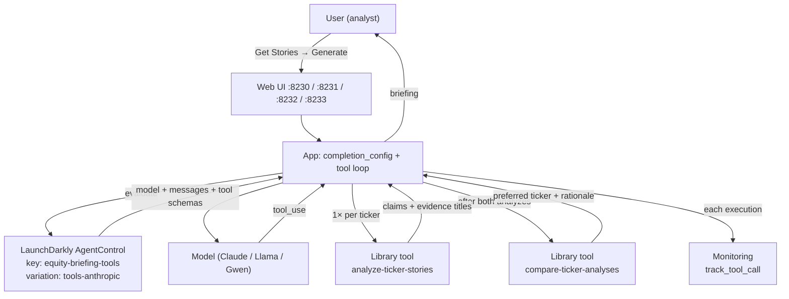

# 23-agent-tools

AgentControl **Library tools** on a completion config: the model must call
`analyze-ticker-stories` once per ticker, then `compare-ticker-analyses`, then
write a briefing grounded in headline evidence. Handlers are deterministic in
app code; schemas live in LaunchDarkly.

Sibling of [22-config-outside-code](../22-config-outside-code/) (metrics/feedback)
and [21-agent-completion-config](../21-agent-completion-config/) (completion + targeting).

Docs: [Tools](https://launchdarkly.com/docs/home/agentcontrol/tools) ·
[Python AI SDK](https://launchdarkly.com/docs/sdk/ai/python)

## Architecture

Tools sit between the user and the final report: LaunchDarkly supplies the tool
**schemas** on the variation; the app runs the model-driven loop and returns a
briefing that cites tool evidence—not free-form invention.



### LaunchDarkly keys (convenience)

| Kind | Key |
|------|-----|
| AI config | `equity-briefing-tools` |
| Variation | `tools-anthropic` |
| Tool | `analyze-ticker-stories` |
| Tool | `compare-ticker-analyses` |

Override the config key in the app with `LD_AGENT_CONFIG_KEY` if needed.

### Why tool calls help the end user

Without tools, the model can invent headlines, skip a ticker, or pick a “winner”
with no evidence trail. Attached Library tools force a **structured path** from
stories → per-ticker analysis → comparison → briefing the user can trust and audit
in the **Tool trace** panel.

- **Grounded claims** — handlers only use titles you fetched; the briefing cites them
- **Comparable structure** — same analyze shape for both tickers before compare
- **Visible work** — tool trace shows what ran (and what local models skipped)
- **Operable in LaunchDarkly** — attach/detach or revise schemas without redeploying the app
- **Observable** — `track_tool_call` / `trackToolCall` / `TrackToolCall` shows up on the config Monitoring tab
  (Java: best-effort `trackMetric` — see [java/README.md](java/README.md))

## Languages

| Language | Port | Status |
|----------|------|--------|
| Python web | **8230** | v1 — AI SDK `completion_config` + `track_tool_call` |
| Node web | **8231** | v1 — AI SDK `completionConfig` + `trackToolCall` |
| Java web | **8232** | v1 — server SDK JSON eval; tool loop in-app; best-effort tool metrics |
| .NET web | **8233** | v1 — AI SDK `CompletionConfig` + `TrackToolCall` |

## Config + tools

| | |
|--|--|
| Config key | `equity-briefing-tools` |
| Mode | completion |
| Variation | `tools-anthropic` → `claude-sonnet-5` |
| Tool 1 | `analyze-ticker-stories` |
| Tool 2 | `compare-ticker-analyses` |

**Analyst Claude** uses Anthropic (`ANTHROPIC_API_KEY`). **Analyst Llama** uses local Ollama `llama3.2:3b`. **Analyst Gwen** uses `llama3.2:1b` (smaller / flakier). Personas are **local UI/runtime choices** — not LaunchDarkly name targeting.

Local models may skip tools; the Ollama path nudges and can force `compare-ticker-analyses` from prior analyze results so the lesson still shows. Prefer Claude for a clean demo.

## Quick start

```bash
export LD_SDK_KEY=sdk-...
export LD_PROJECT_KEY=lunch-marcoly
export LD_ENVIRONMENT_KEY=test
export LD_API_ACCESS_TOKEN=...
export ANTHROPIC_API_KEY=sk-ant-...   # Analyst Claude
# Local Ollama personas:
#   ollama pull llama3.2:3b   # Analyst Llama
#   ollama pull llama3.2:1b   # Analyst Gwen

cd rest
./create-config.sh   # also creates tools + attaches + sets fallthrough

# Python (8230)
cd ../python
source ../../../.venv/bin/activate
python 23-agent-tools.py

# Node (8231)
cd ../node && npm install && npm start

# Java (8232)
cd ../java && ./mvnw -q -DskipTests package && java -jar target/23-agent-tools.jar

# .NET (8233)
cd ../dotnet && dotnet run
```

## What to try

1. **Get Stories** for two tickers.
2. **Analyst Claude** → Anthropic; **Analyst Llama** → `llama3.2:3b`; **Analyst Gwen** → `llama3.2:1b`.
3. Tool trace should show analyze ×2 then compare.
4. Briefing cites headline titles; preferred ticker (if any) matches compare output.
5. Check the config **Monitoring** tab for tool-call events — or run
   `./rest/get-tools-status.sh` (Library · attach · generations).

## Docs

- [application.md](application.md)
- [python/README.md](python/README.md) · [node/README.md](node/README.md) · [java/README.md](java/README.md) · [dotnet/README.md](dotnet/README.md)
- [rest/README.md](rest/README.md)
- Series: [../README.md](../README.md)
