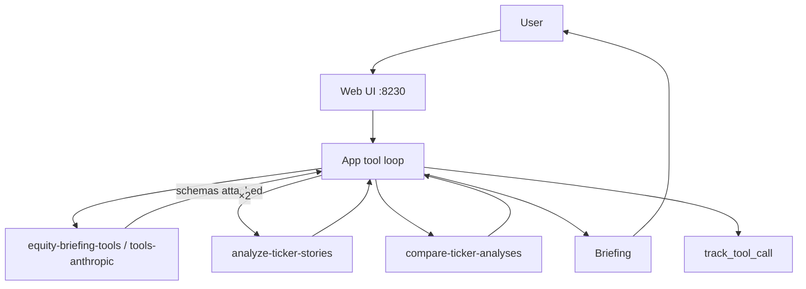

# 23-agent-tools — application

## Goal

Same equity-briefing **news → generate** product as [01-reference-agent](../../01-reference-agent/), but:

1. **Library tools** (schemas) live in LaunchDarkly and are attached to the completion variation.
2. Generate runs a **model-driven tool loop**: analyze each ticker’s stories, then compare analyses.
3. Each executed tool records **`track_tool_call`** (Monitoring).
4. Claims and the optional preferred ticker are **grounded in news titles** (deterministic handlers).

Keywords: AgentControl · Library tools · completion config · tool loop · track_tool_call  
Docs: https://launchdarkly.com/docs/home/agentcontrol/tools · https://launchdarkly.com/docs/sdk/ai/python

## Same vs 21 / 22

| | 21 | 22 | **23** |
|--|----|----|--------|
| Headline | completion + targeting | metrics + feedback | **tools** |
| Tools | none | none | analyze + compare |
| Default LLM | Ollama tiers | Ollama / Anthropic | **Claude → Anthropic**; **Llama → Ollama `llama3.2:3b`**; **Gwen → Ollama `llama3.2:1b`** |
| Personas | LD name targeting | LD name targeting | **Local only** (provider choice in app) |

## Recommended config

| Field | Value |
|-------|--------|
| Key | `equity-briefing-tools` |
| Mode | completion |
| Variation | `tools-anthropic` → `claude-sonnet-5` |
| Tools | `analyze-ticker-stories`, `compare-ticker-analyses` |
| Variable | `{{ stories }}` |

## Generate path

See the [README architecture](README.md#architecture) for the full user-facing diagram and keys.

## Env vars

| Variable | Required | Notes |
|----------|----------|-------|
| `LD_SDK_KEY` | Yes | Server-side SDK key |
| `LD_AGENT_CONFIG_KEY` | No | Default `equity-briefing-tools` |
| `ANTHROPIC_API_KEY` | For Analyst Claude | Claude API key |
| `OLLAMA_HOST` | For Llama / Gwen | Default `http://127.0.0.1:11434` |
| `OLLAMA_MODEL` | Fallback if a persona has no pinned model | Default `llama3.2:3b` |

## Acceptance

- [ ] Tool trace shows 2× analyze + 1× compare when both tickers have stories
- [ ] Briefing cites evidence titles; preferred ticker matches compare when present
- [ ] Monitoring shows tool-call events (`./rest/get-tools-status.sh` for Library · attach · generations)
- [ ] Detach/reattach tools in LD changes behavior without code redeploy
