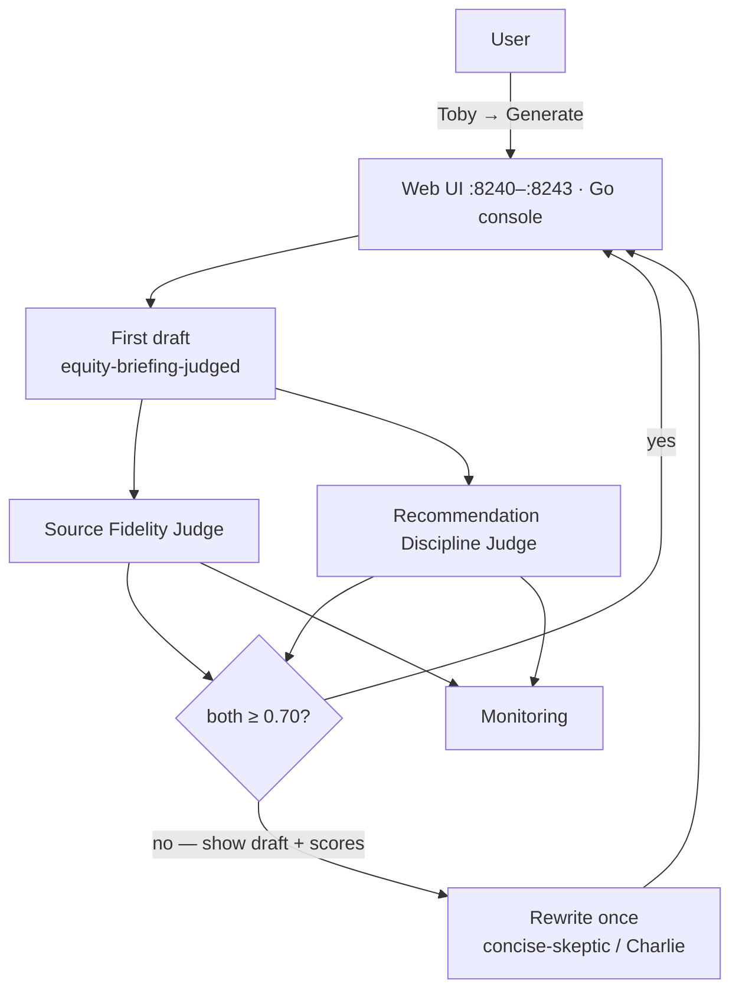

# 24-agent-judges

AgentControl **Judges** as a **runtime quality gate**: generate a briefing, score it with two custom judges, and if either fails, show the bad draft + scores, then **rewrite once** in Conservative Charlie’s voice.

Templated from [01-reference-agent](../../01-reference-agent/) / [21-agent-completion-config](../21-agent-completion-config/) (completion + stories — **not** the 23 tool loop). Sibling lesson: 21 teaches config; 22 metrics; 23 tools; **24 judges + visible rescue**.

Keywords: **AgentControl** · **Judges** · **custom judges** · **online evaluations** · **runtime gate** · **create_judge** · **evaluate**

| Topic | Docs |
|-------|------|
| Judges | [Judges](https://launchdarkly.com/docs/home/agentcontrol/judges) |
| Online evaluations | [Online evaluations](https://launchdarkly.com/docs/home/agentcontrol/online-evaluations) |
| Spec | [application.md](application.md) |

## Architecture



**Teaching order:** runtime gate first (what you see in the panel). Metrics are the receipt.

### Why not 23 + fidelity as a second example?

Fidelity with **tool outputs** in the judge input is sharper for grounded agents, but it is the **same** Judges lesson with a fatter payload. One example on the **21 surface** (stories-only fidelity) is enough. Optional later stretch: feed 23’s tool trace into the same Source Fidelity judge — not a mandatory `25`.

### LaunchDarkly keys

| Kind | Key |
|------|-----|
| Completion config | `equity-briefing-judged` |
| Judge | `equity-briefing-source-fidelity` |
| Judge | `equity-briefing-recommendation-discipline` |
| Variation (Toby) | `reckless-hype` → `llama3.2:1b` |
| Variation (Charlie / rewrite) | `concise-skeptic` → `llama3.2:3b` |

Pass: **both** judges ≥ **0.70**. One rewrite max. Always show scores.

Status helper: `./rest/get-judges-status.sh` (optional `--verbose` for UI/docs links).

## Languages

| Language | Port | Status |
|----------|------|--------|
| Python web | **8240** | Ready — `create_judge` + `evaluate` → Charlie rewrite |
| Node web | **8241** | Ready — `judgeConfig` + Ollama JSON (AI SDK 2.x) |
| Java web | **8242** | Ready — server SDK JSON + Ollama JSON (no Java AI SDK) |
| .NET web | **8243** | Ready — `JudgeConfig` + Ollama JSON |
| Go console | — | Ready — `JudgeConfig` + Ollama JSON (raw-terminal TUI) |

## Demo script (primary)

1. Pull models: `ollama pull llama3.2:1b` and `ollama pull llama3.2:3b`.
2. Provision: `cd rest && ./create-judges.sh && ./create-config.sh`.
3. Select **Thoughtless Toby** → **Get Stories** → **Generate**.
4. Expect: decorated **draft** → **failing judge scores** → **Charlie rewrite**.
5. Optional control: **Conservative Charlie** alone should usually pass without a rewrite.

Toby failing on purpose is success. Charlie is the fix.

## Quick start

```bash
# Series setup — see ../README.md
export LD_SDK_KEY=sdk-...
export LD_PROJECT_KEY=lunch-marcoly
export LD_ENVIRONMENT_KEY=test
export LD_API_ACCESS_TOKEN=...

ollama pull llama3.2:1b
ollama pull llama3.2:3b

cd rest
./create-judges.sh
./create-config.sh

cd ../python
source ../../../.venv/bin/activate
python 24-agent-judges.py   # → http://127.0.0.1:8240/

# Node
cd ../node && npm install && npm start   # → :8241

# Java
cd ../java && ./mvnw -q -DskipTests package && java -jar target/24-agent-judges.jar  # → :8242

# .NET
cd ../dotnet && dotnet run   # → :8243

# Go console
cd ../go && go run .         # TUI — t/c, s, g, q
```

## SDK / provider notes

- **Judges:** Ollama first (`llama3.2:3b`). Revisit Anthropic only if local scores are too flaky for demos.
- **Programmatic gate:** every generate runs both judges (do not rely on attached-judge sampling for the rescue).
- **Python:** `create_judge` + `evaluate` via OpenAI provider → Ollama `/v1` (`OPENAI_BASE_URL`). See [python/README.md](python/README.md).
- **Node / .NET / Go:** AI SDK `JudgeConfig` / `judgeConfig` + Ollama `format:json` (no first-class `create_judge` runner in these SDKs for this example). See language READMEs.
- **Java:** no AI SDK — `jsonValueVariationDetail` + Ollama JSON. See [java/README.md](java/README.md).
- **Attached judges** (optional): same keys for Monitoring charts; metrics validate the gate.

## Docs

- [application.md](application.md) — normative behavior
- [rest/](rest/) — provisioning
- Series: [../README.md](../README.md)
