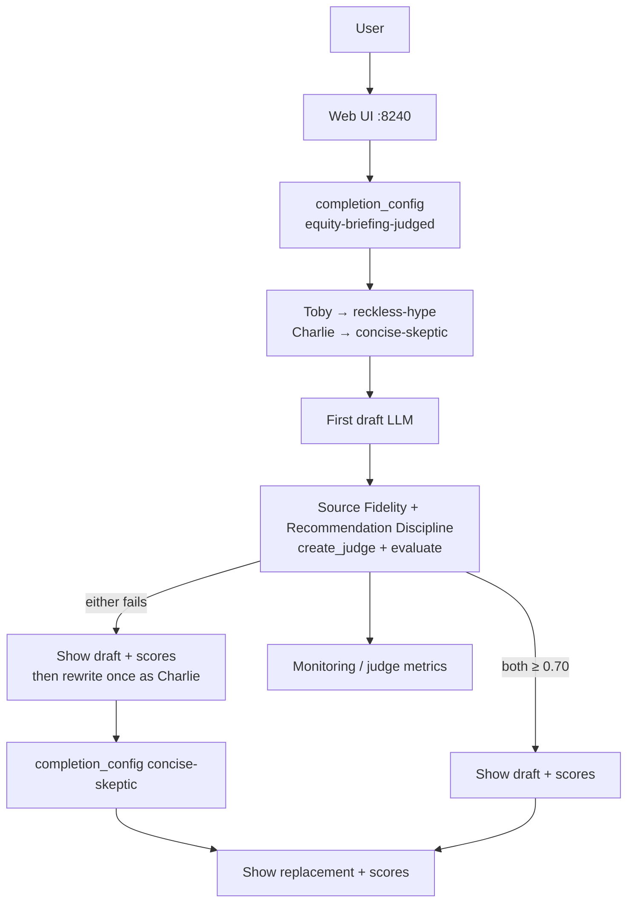

# Agent judges — application specification

This document defines **24-agent-judges**: the equity briefing agent from [01-reference-agent](../../01-reference-agent/application.md) / [21-agent-completion-config](../21-agent-completion-config/), with LaunchDarkly **AgentControl Judges** as a **runtime quality gate**. When judges fail, the app shows the bad draft and scores, then regenerates once with a safer variation (Charlie).

Repository conventions: [project.md](../../project.md).  
Series setup: [20-agent-config README](../README.md).  
Human-oriented overview: [README.md](README.md).

## Goal

1. Same news → generate product shape as `01` / `21`.
2. After the first draft, run **two custom judges** (programmatic `create_judge` + `evaluate`) at **100%** on every generate.
3. If either judge fails the threshold, **decorate** the UI with draft + scores/reasoning, then **rewrite once** using Conservative Charlie’s completion variation.
4. Metrics / Monitoring validate what the learner just saw; the primary lesson is the **visible rewrite**.

This example uses **completion mode** for the briefing config and **judge mode** for the two evaluators — not agent mode, and not Library tools.

## Why base on 21 (not 23 + tools)

| Base | What the learner must already know | What 24 adds |
|------|-------------------------------------|--------------|
| **21** | completion config, personas, `{{ stories }}` | Judges + runtime gate + rewrite |
| **23** | everything in 21 **plus** Library tools, tool loop, guardrails | Same judges, but fidelity input also includes tool outputs |

The **AgentControl concept** in 24 is Judges (evaluate → score → gate). Whether the judge’s *input* is headlines-only or headlines+tool-trace is a **payload** choice, not a second product capability.

**Decision:** ship **one** example on the **21 surface**. Source Fidelity judges against **Yahoo stories only**. A future “tool-grounded fidelity” stretch (or a thin `25`) is optional if classrooms want it — not required to teach Judges.

Keywords: **AgentControl** · **Judges** · **custom judges** · **online evaluations** · **runtime gate** · **create_judge** · **evaluate**

| Topic | Docs |
|-------|------|
| Judges | [Judges](https://launchdarkly.com/docs/home/agentcontrol/judges) |
| Online evaluations | [Online evaluations](https://launchdarkly.com/docs/home/agentcontrol/online-evaluations) |
| AI SDKs | [AI SDKs](https://launchdarkly.com/docs/sdk/ai) |
| Tracking metrics | [Tracking AI metrics](https://launchdarkly.com/docs/sdk/features/ai-metrics) |

## Personas (exactly two)

| Persona | Role in the demo | Completion variation | Ollama model |
|---------|------------------|----------------------|--------------|
| **Thoughtless Toby** | Primary fail fixture — draft should fail judges | `reckless-hype` | `llama3.2:1b` |
| **Conservative Charlie** | Safe rewrite voice (and optional “usually passes” control) | `concise-skeptic` | `llama3.2:3b` |

**Toby always fails is the goal.** Charlie is the refined voice used for the replacement draft.

## LaunchDarkly resources (brand-new keys)

### Completion config

| Attribute | Value |
|-----------|-------|
| **Name** | `Equity briefing judged` |
| **Key** | `equity-briefing-judged` |
| **Mode** | Completion |
| **Purpose** | First-draft (and rewrite) model + system/user messages |

| Variation key | Persona | Model |
|---------------|---------|-------|
| `reckless-hype` | Thoughtless Toby | `llama3.2:1b` |
| `concise-skeptic` | Conservative Charlie (rewrite target) | `llama3.2:3b` |

Messages: adapt from 21’s reckless / skeptic sets — see [rest/messages/](rest/messages/). User messages include `{{ stories }}`.

### Custom judges

| Name | Key | Signal | Desired direction |
|------|-----|--------|-------------------|
| Source Fidelity Judge | `equity-briefing-source-fidelity` | Grounded in headlines; no ticker confusion; no inventions | Higher is better |
| Recommendation Discipline Judge | `equity-briefing-recommendation-discipline` | Cautious; hedges; does not hype or invent certainty | Higher is better |

Both judges:

- Mode: **Judge** / type **Custom**
- Provider: **Ollama** (start local; revisit Anthropic only if scores are too flaky)
- Suggested judge model: `llama3.2:3b` (stronger than Toby’s draft model)
- Metric keys (required `$ld:ai:judge:` prefix): `$ld:ai:judge:source-fidelity`, `$ld:ai:judge:recommendation-discipline`
- **No tools** on judges; **no judges attached to judges**

Judge prompts (normative intent) live under [rest/messages/](rest/messages/) (`judge-source-fidelity-*.txt`, `judge-recommendation-discipline-*.txt`).

### Pass / fail rules

| Rule | Value |
|------|-------|
| Score range | `0.0`–`1.0` (LaunchDarkly structured judge output) |
| Pass threshold | **≥ 0.70** per judge (tunable via env later if needed) |
| Combine | **AND** — both must pass |
| On fail | Show draft + both scores/reasoning → **one** rewrite with Charlie → show replacement + scores on rewrite (always show scores; do not loop) |
| Charlie rewrite fails | Accept and surface scores; no second rewrite (deal with flakiness if classrooms hit it) |

### Sampling

Every generate runs **both** judges programmatically (`evaluate` on the draft). Treat evaluation as **100%** for the demo. Sampling &lt; 100% on *attached* judges would skip some Monitoring points; the runtime gate must not depend on sampling.

Attached judges (optional, same keys) may also be wired for Monitoring charts — metrics validate the gate the user already watched.

## Application generate path



### Generate step (normative)

1. Build LD context from the selected persona (`key` / `name` for Toby or Charlie).
2. Evaluate `equity-briefing-judged` with `{"stories": <formatted headlines>}`.
3. Call the LLM; capture the **full draft** (non-streaming or buffer-then-decorate — UI may still stream chunks for feel).
4. Build judge **input** = task + formatted stories (and tickers). **Output** = draft text.
5. `create_judge` + `evaluate` for both judge keys (Ollama). Collect `score` + `reasoning`.
6. Decorate the response panel so a new user can see sections, e.g.:
   - `--- Draft (Thoughtless Toby) ---`
   - `--- Judge scores ---` (each score + short reasoning)
   - if failed: `--- Rewrite (Conservative Charlie) ---` then replacement text
7. If either score &lt; 0.70: evaluate Charlie’s variation (or force `concise-skeptic`), generate **once**, append replacement; optionally re-score the rewrite for display only (no further rewrite).
8. Track generation / judge-related metrics so Monitoring corroborates the demo (exact tracker API per AI SDK version — document in language README).
9. On LD or judge/provider failure: clear status error; do not silently skip the gate in the happy-path demo script.

## Local Ollama requirement

```bash
ollama pull llama3.2:1b    # Toby draft
ollama pull llama3.2:3b    # Charlie rewrite + judges
```

No Anthropic key required for v1.

## Acceptance criteria

- [ ] Provisioning creates `equity-briefing-judged` + both judge configs (REST preferred).
- [ ] Python web on **8240**; Toby generate shows draft, failing scores, and Charlie rewrite (decorated).
- [ ] Node web on **8241**; same gate UX as Python.
- [ ] Java web on **8242**; same gate UX (server SDK JSON + Ollama judge JSON).
- [ ] Charlie-only generate usually passes (or shows scores without a forced rewrite when both ≥ 0.70).
- [ ] At most one rewrite per generate.
- [ ] README documents keys, thresholds, Ollama tags, and demo script (Toby → rewrite).
- [ ] Series landing lists 24; inventory stub includes the three keys.

## Out of scope (v1)

- Library tools / 23 tool loop in the fidelity judge input
- Java / .NET / Go / Node ports
- Multi-rewrite loops; Anthropic judges
- Guarded rollout wiring of judge metrics (mention as further reading only)

## Related

- [21-agent-completion-config](../21-agent-completion-config/) — completion + personas (base shape)
- [23-agent-tools](../23-agent-tools/) — tools (optional future fidelity sharpening)
- [22-config-outside-code](../22-config-outside-code/) — tracked metrics + feedback
- [Judges](https://launchdarkly.com/docs/home/agentcontrol/judges)
