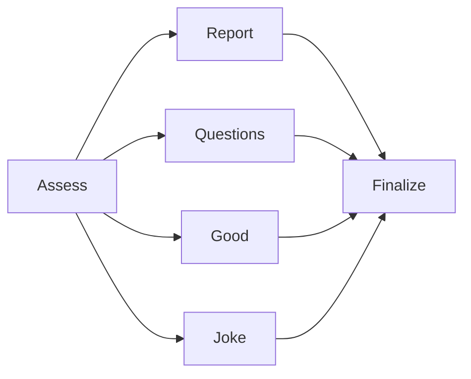

# 25-agent-graph

LaunchDarkly **AgentControl Agent Graphs**: a multi-step equity briefing demo.

**assess → specialist → finalize**, with several UI actions and a **Trace** dock so learners can see the graph path match what ran.

Normative spec: [application.md](application.md).

Keywords: **AgentControl** · **Agent graphs** · **Agents** · **handoffs** · **create_agent_graph**

| Topic | Docs |
|-------|------|
| Agent graphs | [Agent graphs](https://launchdarkly.com/docs/home/agentcontrol/agent-graphs) |
| Agents | [Agents](https://launchdarkly.com/docs/home/agentcontrol/agents) |

## What you click

| Button | Specialist | Stories? |
|--------|------------|----------|
| Generate AI Report | `report` | Required |
| Identify questions | `questions` | Required |
| Identify good & bad | `good` | Required |
| Tell me a joke | `joke` | Optional |

Joke path also prints a **code-only** easter egg: `Setting humor level to 25%|50%|90%` (Charlie / Amelia / Toby). Tickers/headlines are optional upside for the joke — not required. Joke sampling uses higher temperature plus a rotating variety nudge (not “never repeat”).

The **good** specialist returns both **## Good** and **## Bad** sections.

## Graph (v1)



- **One** agent graph: `equity-briefing-graph`
- Persona targeting: **report** node only
- Tools: question-gap + joke-corny scorers (app-side Trace labels)
- Bad-news specialist: **next iteration**

## Quick start

```bash
# Series setup — see ../README.md
export LD_SDK_KEY=sdk-...
export LD_API_ACCESS_TOKEN=api-...
export LD_PROJECT_KEY=lunch-marcoly
export LD_ENVIRONMENT_KEY=test
ollama pull llama3.2:3b

cd rest && ./create-all.sh
cd ../python && python 25-agent-graph.py   # → http://127.0.0.1:8250/
```

| Language | Port | Entry |
|----------|------|-------|
| Python | **8250** | [python/](python/) |
| Node | **8251** | [node/](node/) |
| Java | **8252** | [java/](java/) |
| .NET | **8253** | [dotnet/](dotnet/) |

Series portals: Python **:8200** · Node **:8201** (Graph tab).

## Status

| Piece | State |
|-------|--------|
| Spec | [application.md](application.md) |
| REST | [rest/](rest/) — `create-all.sh` |
| Python web (:8250) | Ready |
| Node web (:8251) | Ready |
| Java web (:8252) | Ready |
| .NET web (:8253) | Ready |
| Portal tabs | Python + Node wired |
| Go | Later |

## Related

- [21-agent-completion-config](../21-agent-completion-config/) — completion + personas
- [23-agent-tools](../23-agent-tools/) — tools pattern
- [24-agent-judges](../24-agent-judges/) — Trace UX
- [20-agent-config README](../README.md)
