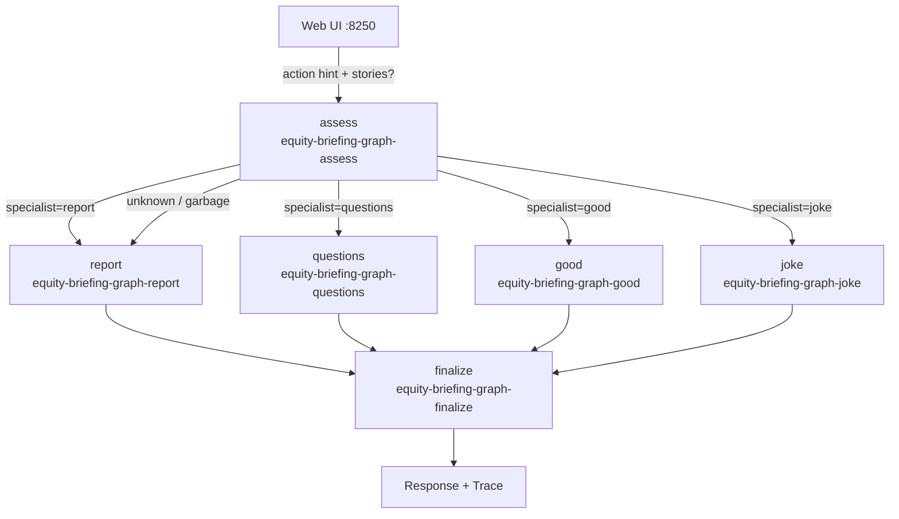

# Agent graph — application specification

This document defines **25-agent-graph**: the equity briefing UI from [01-reference-agent](../../01-reference-agent/application.md) / [21-agent-completion-config](../21-agent-completion-config/), with LaunchDarkly **AgentControl Agent Graphs** as a **multi-step orchestration** demo. One graph: **assess → specialist → finalize**. Multiple UI actions select the intended specialist; Trace shows the path so learners can correlate the LD graph with what ran.

Repository conventions: [project.md](../../project.md).  
Series setup: [20-agent-config README](../README.md).  
Human-oriented overview: [README.md](README.md).

## Goal

1. Teach **Agent Graphs**: topology outside the app; nodes are agent-mode configs; edges are handoffs.
2. Show **model selection + tools + modern multi-agent flow** in one classroom path.
3. Correlate **LaunchDarkly graph** ↔ **UI / Trace** (`assess → specialist → finalize`).
4. Keep **v1 linear and simple** — no rework / re-route loops yet.

Keywords: **AgentControl** · **Agent graphs** · **Agents** · **create_agent_graph** · **traverse** · **handoffs** · **targeting**

| Topic | Docs |
|-------|------|
| Agent graphs | [Agent graphs](https://launchdarkly.com/docs/home/agentcontrol/agent-graphs) |
| Agents | [Agents](https://launchdarkly.com/docs/home/agentcontrol/agents) |
| Tutorial | [Agent graphs as harness](https://launchdarkly.com/docs/tutorials/agent-graphs) |
| AI SDKs | [AI SDKs](https://launchdarkly.com/docs/sdk/ai) |

## Why this product shape

Prior examples (21–24) share one job: **Generate AI Report**. A graph needs **different specialist jobs**, not “same briefing, different model.”

**Decision:** keep the familiar report action, and add **intent buttons**. Each button sets an `action` hint; Step 1 (assess) returns a structured specialist route; Step 2 runs that specialist; Step 3 (finalize) applies shared chrome.

| Base | Learner already knows | 25 adds |
|------|------------------------|---------|
| **21** | personas, stories, completion | Graph orchestration |
| **23** | Library tools + tool loop | Tools only on the **report** specialist (v1) |
| **24** | Trace dock, judges | Trace maps graph nodes (no judges in v1) |

## Personas (exactly three)

| Persona | Humor easter egg (code-only) | Report-node targeting (v1) |
|---------|------------------------------|----------------------------|
| **Conservative Charlie** | `Setting humor level to 25%` | Cautious report variation |
| **Anonymous Amelia** | `Setting humor level to 50%` | Default / fallthrough report variation |
| **Thoughtless Toby** | `Setting humor level to 90%` | Reckless / simple report variation |

- **Assess** and **finalize** are persona-agnostic (no targeting by persona in v1).
- **Report** specialist uses existing-style **name targeting** (Charlie / Toby / Amelia → variation).
- Humor line is **app code only** (not an LLM message), shown when the **joke** path runs — before or with the joke specialist output.

## UI actions (v1)

One **Response** panel for all actions. Trace shows the branch.

| Button | `action` hint | Stories required? | Specialist key |
|--------|---------------|-------------------|----------------|
| **Generate AI Report** | `report` | Yes | `report` |
| **Identify questions** | `questions` | Yes | `questions` |
| **Identify good & bad** | `good` | Yes | `good` (## Good + ## Bad) |
| **Tell me a joke** | `joke` | **No** | `joke` |

**Note:** There is no separate “bad” button — the `good` specialist covers both sides in one response.

Router-internal labels (intent / data-path) may appear in assess `reason` text and Trace — **not** as extra buttons.

## Graph shape (normative)



### Step contracts

**Step 1 — assess** (root)

- Input: `action` hint, optional stories summary, tickers.
- Output (structured JSON): `{ "specialist": "report"|"questions"|"good"|"joke", "reason": "…" }`.
- Prefer the button’s `action` when valid; still **run** assess for Trace teaching consistency.
- If output is missing/invalid → **fall through to `report`** (linear / simple).

**Step 2 — specialists**

| Key | Job | Tools (v1) | Notes |
|-----|-----|------------|-------|
| `report` | Equity briefing as in 21/23 spirit | Optional Library tools (analyze/compare) | Persona targeting lives **here** |
| `questions` | Score curated list; return 2–3 highest-priority gaps | None | Reads [rest/messages/questions.txt](rest/messages/questions.txt) |
| `good` | Surface **good and bad** signals in two sections | None | Domain specialist |
| `joke` | Whimsical market joke (variety-oriented sampling) | None | Always allowed; humor % from persona (code) |

**Step 3 — finalize** (shared)

- Input: specialist draft + original action + light context.
- Job: brief polish, structure, “chrome” — one node for all intents.
- No persona targeting in v1.

## LaunchDarkly resources (brand-new keys)

### Agent graph

| Attribute | Value |
|-----------|-------|
| **Name** | `Equity briefing graph` |
| **Key** | `equity-briefing-graph` |
| **Root** | `equity-briefing-graph-assess` |

Edges (logical):

| From | To | When |
|------|-----|------|
| assess | report | `specialist=report` (or fallback) |
| assess | questions | `specialist=questions` |
| assess | good | `specialist=good` |
| assess | joke | `specialist=joke` |
| report / questions / good / joke | finalize | always after specialist |

### Agent-mode node configs

| Name | Key | Role |
|------|-----|------|
| Graph assess | `equity-briefing-graph-assess` | Router / triage |
| Graph report | `equity-briefing-graph-report` | Briefing specialist (+ tools later/now as available) |
| Graph questions | `equity-briefing-graph-questions` | Gap-priority questions |
| Graph good | `equity-briefing-graph-good` | Good-news specialist |
| Graph joke | `equity-briefing-graph-joke` | Joke specialist |
| Graph finalize | `equity-briefing-graph-finalize` | Shared polish |

All nodes: **mode = agent** (or the SDK/graph-supported agent shape for the current AI SDK). Provider: **Ollama** for classroom purity (`llama3.2:3b` default; report may use persona-tier models like 21).

Provisioning: prefer REST under [rest/](rest/) (create graph + node configs + targeting for report). Exact API shapes follow current Agent Graphs docs/API.

## Questions input file

Source of truth: [rest/messages/questions.txt](rest/messages/questions.txt).

- Curated **5–10** questions a diligent analyst might ask next.
- Questions specialist **scores** each against available headlines (and notes gaps).
- **Lowest information / highest gap** → highest priority; return **2–3** questions (with short why).

## Application run path

1. User loads stories (except joke) and picks a persona + action button.
2. App builds LD context (`key` / `name` for persona; custom attrs for `action` as needed).
3. App runs the graph (`create_agent_graph` / traverse — Python AI SDK first).
4. Before joke specialist (or at start of joke path): emit code-only status/Trace line `Setting humor level to {25|50|90}%`.
5. Stream or buffer node outputs; **Trace** one line per step: `assess` → `{specialist}` → `finalize`.
6. Show final text in the single Response panel.
7. On LD/graph failure: clear status error; optional code baseline only if we document one (prefer fail loud in v1).

### Trace (required)

Same dock pattern as 21–24. Map SSE (or synthetic) events:

| Step | Trace kind (example) |
|------|----------------------|
| Start | `run` + action + persona |
| Humor easter egg | `info` — `Setting humor level to 90%` |
| Assess | `assess` + specialist + clipped reason |
| Specialist | `report` / `questions` / `good` / `joke` + clip |
| Finalize | `finalize` + clip |
| Done | `done` |

## Local Ollama (v1)

```bash
ollama pull llama3.2:3b    # assess, specialists, finalize default
ollama pull llama3.2:1b    # optional Toby report tier
# optional mid/best tiers if report targeting mirrors 21
```

No Anthropic key required for v1.

## Languages / ports

| Language | Port | v1 status |
|----------|------|-----------|
| Python web | **8250** | Ready — graph + Trace; portal tab |
| Node web | **8251** | Ready — portal tab |
| Java web | **8252** | Ready — `jsonValueVariationDetail` (no Java AI SDK) |
| .NET web | **8253** | Ready |
| Go | — | Later |

## Acceptance criteria

- [x] Provisioning creates graph `equity-briefing-graph` + six node configs (or documented equivalent).
- [x] Web ports: Python **8250**, Node **8251**, Java **8252**, .NET **8253**; series portals wire Graph tabs.
- [x] Each action runs **assess → specialist → finalize**; Trace shows the path.
- [x] Joke works **without** stories; prepends humor-level line from persona.
- [x] Report requires stories; uses persona targeting on the report node.
- [x] Questions specialist reads `questions.txt` and returns 2–3 gap-prioritized questions.
- [x] Unknown assess output falls through to **report**.
- [x] README documents keys, buttons, humor table, Ollama tags.
- [x] Series landing lists **25**; inventory stub includes graph + node keys.

## Out of scope (v1)

- Identify the bad as a **separate** button/specialist (folded into good+bad instead)
- Persona targeting on assess / finalize
- Rework / re-route / multi-hop after finalize
- Judges on graph output
- Full multi-language ports beyond Python/Node/Java/.NET (Go later)
- Anthropic-required happy path

## Related

- [21-agent-completion-config](../21-agent-completion-config/) — personas + completion targeting
- [23-agent-tools](../23-agent-tools/) — Library tools pattern for report node
- [24-agent-judges](../24-agent-judges/) — Trace dock UX to reuse
- [Agent graphs](https://launchdarkly.com/docs/home/agentcontrol/agent-graphs)
