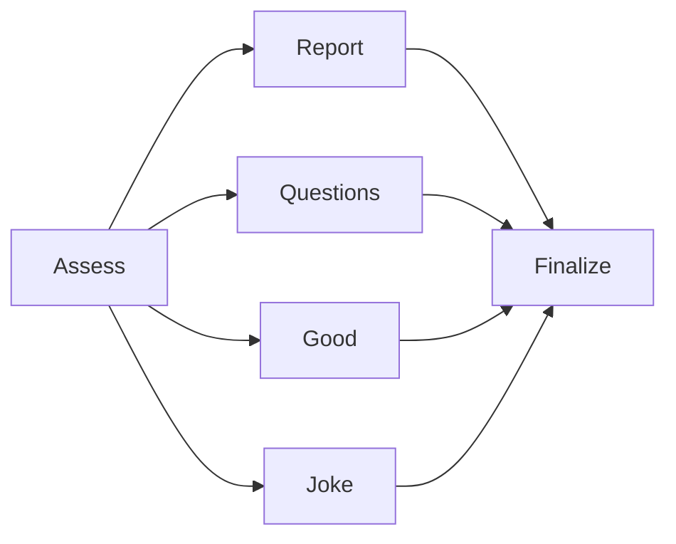

# 25-agent-graph — Java web

Port **8252**. Requires Java **21+**, `LD_SDK_KEY`, a provisioned agent graph +
six agent-mode node configs (see [../rest/](../rest/)), and local Ollama.

**Java has no official AI SDK**, so there is no `agent_graph()` /
`create_agent_graph()` helper either. Python's AI SDK evaluates the graph key
as JSON shaped `{ root, edges }` (edges keyed by source config → array of
`{key, handoff}` targets) and each agent node key as JSON shaped
`{ instructions, model, provider, _ldMeta }` — see `ldai/client.py`
`agent_graph()` in the Python AI SDK for the reference shape this port
mirrors. This twin evaluates the same graph + node keys with the **Java
server SDK** (`jsonValueVariationDetail` / `LDValue`), walks
**assess → specialist → finalize** by hand, validates handoffs against the
evaluated edges, and fires the same `$ld:ai:graph:*` Monitoring events an
`AIGraphTracker` would (best-effort — Java has no AI SDK graph tracker class).

Keywords: **AgentControl** · **Agent graphs** · **Agents** · **handoffs** · **JSON variation**

| Topic | Docs |
|-------|------|
| Agent graphs | [Agent graphs](https://launchdarkly.com/docs/home/agentcontrol/agent-graphs) |
| Agents | [Agents](https://launchdarkly.com/docs/home/agentcontrol/agents) |
| Java server SDK | [Java server-side SDK](https://launchdarkly.com/docs/sdk/server-side/java) |
| Note | Java AI SDK N/A — server SDK JSON variation + manual graph walk |
| Spec | [../application.md](../application.md) |

## Prerequisites

```bash
export LD_SDK_KEY="sdk-..."
ollama pull llama3.2:3b    # assess, specialists, finalize default
ollama pull llama3.2:1b    # optional Toby report tier

cd ../rest && ./create-all.sh
```

## Build & run

```bash
cd 20-agent-config/25-agent-graph/java
./mvnw -q -DskipTests package
java -jar target/25-agent-graph.jar
```

Open **http://127.0.0.1:8252/** (Python twin: **8250**).

## Demo

1. **Get Stories** for two tickers.
2. Select a user (Charlie / Amelia / Toby) and click an action button.
3. Trace shows **assess → {specialist} → finalize**; the mini path map lights
   the edges the graph actually validated.
4. **Tell me a joke** works without stories and prints a code-only
   `Setting humor level to {25|50|90}%` line before the joke specialist runs.

## Graph (v1)



| Button | Specialist | Stories? |
|--------|------------|----------|
| Generate AI Report | `report` | Required |
| Identify questions | `questions` | Required |
| Identify good & bad | `good` | Required |
| Tell me a joke | `joke` | Optional |

## Java vs Python (agent graphs)

| Step | Python | Java |
|------|--------|------|
| Graph evaluation | AI SDK `agent_graph()` | `jsonValueVariationDetail` on the graph key, parsed by hand |
| Node evaluation | AI SDK `agent_config()` | `jsonValueVariationDetail` on each node key |
| Edge validation | `AgentGraphDefinition.get_node().get_edges()` | Manual `root`/`edges` JSON walk |
| Graph tracker | `graph.create_tracker()` (`AIGraphTracker`) | Best-effort `trackMetric` on `$ld:ai:graph:*` |
| Node success/tool tracker | `config.create_tracker()` (`LDAIConfigTracker`) | Best-effort `trackMetric` on `$ld:ai:generation:success` / `$ld:ai:tool_call` |
| Ollama | `urllib` streaming + non-streaming | `java.net.http.HttpClient` streaming + non-streaming |

Prefer Python when the lesson is first-class `agent_graph()` / handoff
tracking. This Java twin is for classrooms that want the exact same graph
topology and Trace UX without a Java AI SDK dependency.

## Architecture

| File | Role |
|------|------|
| `WebServer.java` | HTTP + SSE |
| `AgentCore.java` | **LD insertion:** JSON variation (graph + 6 agent nodes) → manual walk → Ollama |
| `YahooNews.java` | Yahoo headlines + `../stories/` cache |
| `src/main/resources/public/index.html` | Browser UI (Trace dock + mini path map) |

## Environment

| Variable | Required | Notes |
|----------|----------|-------|
| `LD_SDK_KEY` | Yes | Server-side SDK key |
| `LD_GRAPH_KEY` | No | Default `equity-briefing-graph` |
| `LD_NODE_ASSESS` | No | Default `equity-briefing-graph-assess` |
| `LD_NODE_REPORT` | No | Default `equity-briefing-graph-report` |
| `LD_NODE_QUESTIONS` | No | Default `equity-briefing-graph-questions` |
| `LD_NODE_GOOD` | No | Default `equity-briefing-graph-good` |
| `LD_NODE_JOKE` | No | Default `equity-briefing-graph-joke` |
| `LD_NODE_FINALIZE` | No | Default `equity-briefing-graph-finalize` |
| `JOKE_TEMPERATURE` | No | Default `0.95` |
| `JOKE_CORNY_HIGH` / `JOKE_CORNY_LOW` | No | Default `0.80` / `0.20` |
| `OLLAMA_HOST` | No | Default `http://127.0.0.1:11434` |
| `OLLAMA_MODEL` | No | Default `llama3.2:3b` (SDK defaults) |
| `PORT` | No | Default `8252` |

Parent: [../README.md](../README.md) · Spec: [../application.md](../application.md) · Python twin: [../python/README.md](../python/README.md)
