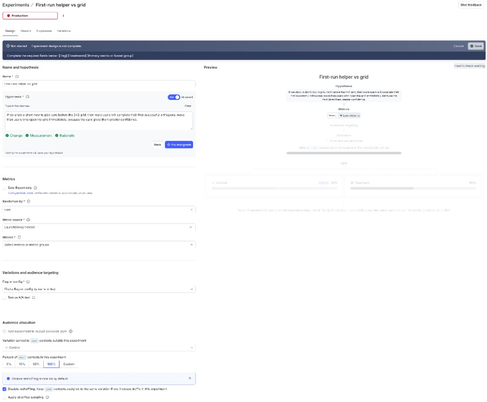

# 53-mobile-experiment

One LaunchDarkly **Experimentation** test across native Android and iOS.
Control versus treatment is the causal comparison; `platform` is an analysis
dimension, not an assignment.

| Item | Value |
|------|-------|
| Flag | `acme-mobile-onboarding-v2` |
| Control | `false` — open the grid directly |
| Treatment | `true` — show a short How to play helper |
| Primary metric/event | `mobile_onboarding_completed` |
| Randomization unit | `user` |
| Result attributes | `platform`, `app-version` |

The conversion is tracked once after the first successful orthogonal grid
move. Both apps evaluate the flag first, so exposure precedes conversion.

Keywords: **Experimentation** · **mobile SDK** · **exposure** · **conversion** ·
**platform analysis**

Docs: [Create an experiment](https://launchdarkly.com/docs/home/experimentation/create) ·
[Experimentation events](https://launchdarkly.com/docs/home/experimentation/events) ·
[Exposure validation](https://launchdarkly.com/docs/home/experimentation/exposure-validation)

## Implementations

| Platform | Directory | Status |
|----------|-----------|--------|
| Android · Kotlin / Compose | [android/](android/) | Complete |
| iOS · Swift / SwiftUI | [ios/](ios/) | Complete |

Full behavior contract: [application.md](application.md).

## Provision

This example uses your existing LaunchDarkly project. All scripts receive the
destination through environment variables; no project ID or credential is
embedded in mobile code.

```bash
export LD_API_ACCESS_TOKEN="api-..."
export LD_PROJECT_KEY="lunch-marcoly"
export LD_ENVIRONMENT_KEY="experiment"
export LD_MOBILE_KEY="mob-..." # mobile key for that environment

(cd rest && ./create-flag.sh && ./create-metric.sh && ./status.sh)
./sync-mobile-key.sh
```

[Terraform](terraform/) can create the flag, environment configuration, and
metric instead. The experiment itself is configured and reviewed in the
LaunchDarkly dashboard; [rest/](rest/) includes a current API-shaped draft
payload to make its IDs and fields visible. Nothing automatically starts an
experiment.

## Experiment setup

Create the experiment in the LaunchDarkly dashboard. Do not name it after the
flag. The flag display name is **Acme: mobile onboarding helper**; a near
duplicate such as **Acme mobile onboarding helper** (same words, no colon)
makes the two hard to tell apart in lists and breadcrumbs.

Recommended experiment name:

```text
First-run helper vs grid
```

Paste this hypothesis into the Hypothesis field (the code block copies as a
single clipboard snippet). It is written to pass LaunchDarkly's inline
Change / Measurement / Rationale check:

```text
If we show a short How to play card before the 2×2 grid, then more users will complete their first successful orthogonal move than users who open the grid immediately, because the card gives them greater confidence.
```

Then match the Design tab:

| Field | Value |
|-------|-------|
| Randomize by | `user` |
| Metric source | LaunchDarkly hosted |
| Metrics | `mobile_onboarding_completed` |
| Flag or config | Acme: mobile onboarding helper |
| Audience allocation | 100% of `user` contexts in this experiment |
| Disable reshuffling | On (leave the default) |

Do not target a treatment by platform. After the flag is selected, keep the
50/50 Control / Treatment split. Add result attributes `platform` and
`app-version`. Validate exposure and conversion from both platforms before
starting a decision-making run.



Analyze overall control versus treatment first. Then inspect Android treatment
versus Android control and iOS treatment versus iOS control. A higher raw
completion rate on one operating system is not evidence that the operating
system caused the difference.

## Classroom isolation

Concurrent users sharing one environment also share targeting, allocation, and
experiment results. `LD_PROJECT_KEY` chooses the project; the practical
classroom isolation boundary is a distinct `LD_ENVIRONMENT_KEY` and that
environment's `LD_MOBILE_KEY` for each participant.

This repository documents those overrides but **does not solve multi-user
environment creation or orchestration yet**. Do not run synthetic or classroom
traffic in an environment used for real decisions.

## Synthetic traffic

[simulation/](simulation/) evaluates the same flag for stable synthetic users,
half tagged `platform=android` and half `platform=ios`, then tracks conversions
at configurable control/treatment probabilities:

```bash
export LD_SDK_KEY="sdk-..." # server key for a dedicated experiment environment
python simulation/simulate.py \
  --count 1000 \
  --control-probability 0.30 \
  --treatment-probability 0.45
```

This tests event plumbing and makes result slices visible. It is synthetic
evidence, not a product decision.
