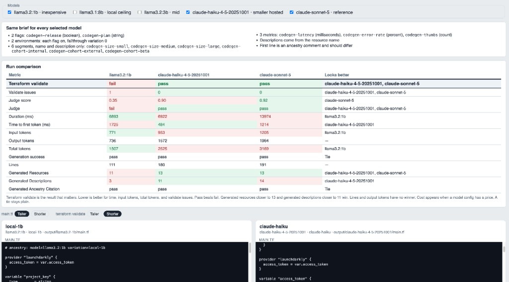
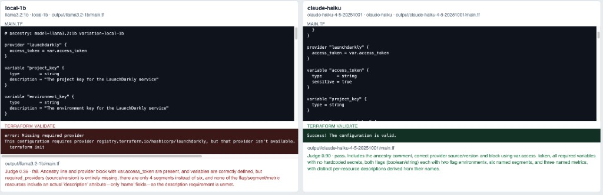
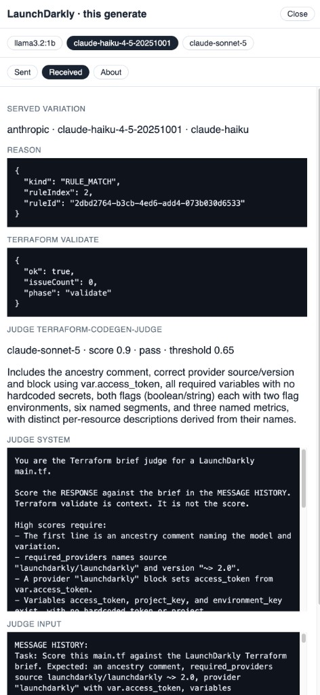

# 04-terraform-codegen

**Status: Python :8740.** Selected models write the same LaunchDarkly Terraform file. The app saves each `main.tf`, runs `terraform validate`, then a Sonnet judge scores the file. It does not apply and it does not rewrite. No series portal.

One completion config, one click. The runs are sequential. Checkboxes choose which models run. AgentControl serves each variation, and `track_metrics_of` records the call. The judge is a separate config.

`ANTHROPIC_API_KEY` is required for the hosted models and for the judge. Without it, Haiku and Sonnet stay off the model list, and a local file is still validated but not scored. The key stays in the server process. It is never sent to the browser.

| | |
|--|--|
| Config | `terraform-codegen-compare` |
| `local-1b` | `llama3.2:1b`, inexpensive, context key `codegen-1b` |
| `local-8b` | `llama3.1:8b`, local ceiling, context key `codegen-8b` |
| `local-3b` | `llama3.2:3b`, fallthrough, unchecked on the screen |
| `claude-haiku` | `claude-haiku-4-5-20251001`, smaller hosted, context key `codegen-haiku` |
| `claude-sonnet` | `claude-sonnet-5`, reference, context key `codegen-sonnet` |
| Judge | `terraform-codegen-judge` → `claude-sonnet-5`, threshold 0.65 |
| Files | `output/<model-id>/main.tf` |

The first line of each file is an ancestry comment. That line is supposed to differ. Descriptions are written from the resource name. Keys stay fixed.

Keywords: **AgentControl** · **completion config** · **runtime variables** · **track_metrics_of**

| Topic | Docs |
|-------|------|
| Python AI SDK | [Python AI SDK](https://launchdarkly.com/docs/sdk/ai/python) |
| Completion config | [Quickstart](https://launchdarkly.com/docs/home/agentcontrol/quickstart) |
| Terraform | [Terraform](https://launchdarkly.com/docs/guides/infrastructure/terraform) |

Outline: [application.md](application.md).

## Setup

```bash
export LD_API_ACCESS_TOKEN="api-..."
export LD_PROJECT_KEY="lunch-marcoly"
export LD_ENVIRONMENT_KEY="test"
cd 70-model-demos/04-terraform-codegen/rest
./create-config.sh

ollama pull llama3.2:1b
ollama pull llama3.2:3b
```

`create-config.sh` reuses the shared Ollama model configs when they already exist, including `Custom.llama3.1-8b`, and adds variations `local-1b`, `local-8b`, and `claude-sonnet`. If the config already exists, add the missing ones with `add-local-8b-variation.sh` and `add-claude-variation.sh`. `delete-config.sh` removes only `terraform-codegen-compare`.

## Run

```bash
export LD_SDK_KEY="sdk-..."
export ANTHROPIC_API_KEY="sk-ant-..."
cd 70-model-demos/04-terraform-codegen/python
python 04-terraform-codegen.py
```

Open **http://127.0.0.1:8740/**. Use the repo virtualenv if `python` cannot import `ldai`. `terraform` must be on `PATH` for validate. The first click downloads the provider into `output/.plugin-cache`.

The server reads `ANTHROPIC_API_KEY` when it starts. Restart it after you export the key. Haiku (`claude-haiku-4-5-20251001`) and Sonnet (`claude-sonnet-5`) then appear as checkboxes. The judge calls Sonnet with that same key after every selected file, including the Ollama ones.

## What you will see

**Generate** runs the checked models in order. Each writes `output/<model-id>/main.tf`, validates it, then the Sonnet judge scores it. Unchecked models stay off the table and off the file panels. The header shows **Running** while Generate is in flight and **Finished** when the stream ends.

The comparison table leads with Terraform validate. A fail is red and a pass is green. The judge row uses the same colors against the 0.65 line. Lower time, input tokens, total tokens, and validate issues win. Generated resources closer to 13 and generated descriptions closer to 11 win. Lines and output tokens have no winner. A tie stays plain. Cost stays off the table until a served model config has a price.

In this run, `llama3.2:1b` fails validate with one issue and the judge scores it 0.35. Haiku and Sonnet both pass validate. Haiku scores 0.90. Sonnet scores 0.92 and wins the judge row. Haiku wins generated descriptions because 11 is the target and Sonnet wrote 14.



Each selected model then shows `main.tf` and the validate output. **Taller** is the default for the file. **Shorter** is the default for validate. A failed validate stays on screen in red. A success is green. The judge sentence sits under the file path.



**LD details** opens a drawer. The model switcher keeps one sent/received record per selected model. Received shows the served variation, the evaluation reason, the validate result, and the judge score plus the prompt Sonnet used.



## Later

Segments can gain a rule clause, an included context list, or tags. The judge does not rewrite the file.
